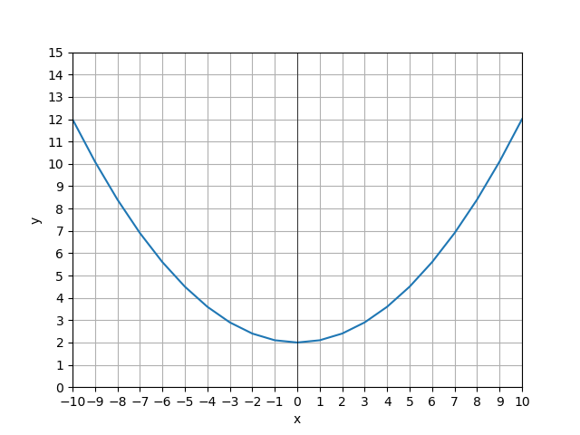
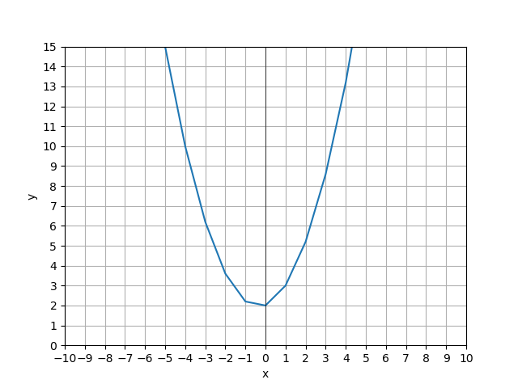
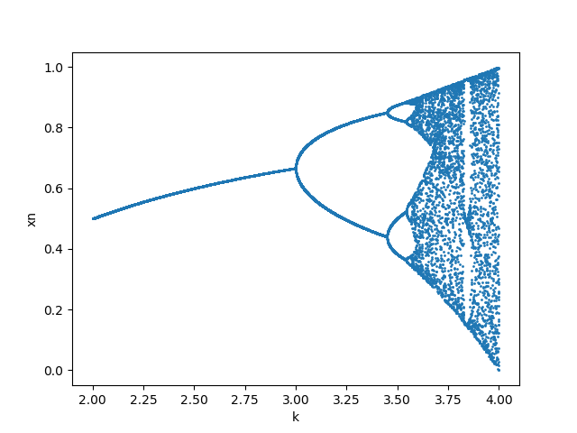
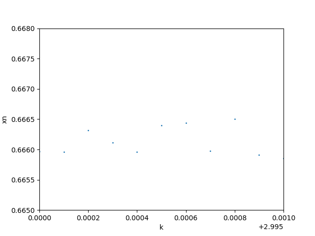
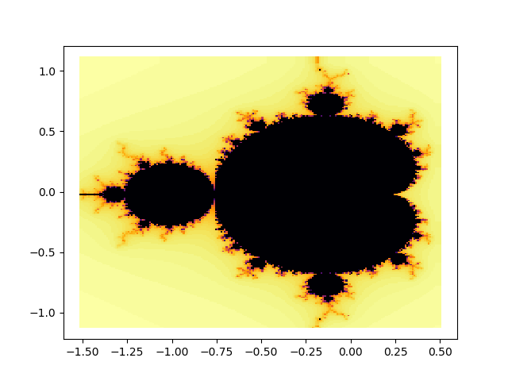
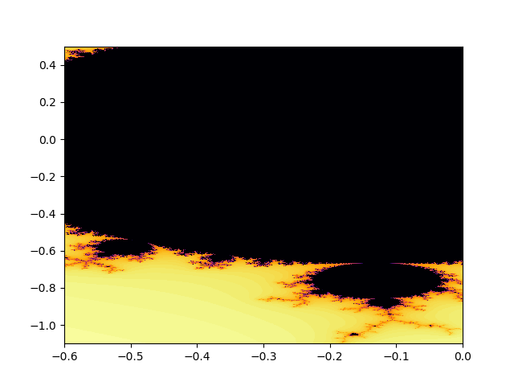

# 第三回 Pythonでのグラフ描画
* 実験年月日 2018/06/04
* 提出年月日 2018/06/04
* 班番号 6
* 報告者 3年19番6班 末田 貴一
* 共同実験者
    * 7番 川上 求
    * 42番 山崎 敦史
    * 47番 ロンサン
## 問題3.1
### ソースコード
```
import matplotlib.pyplot as plt

xs=[]
ys=[]

for x in range(-10,11):
    y=x**2/10+2
    xs.append(x)
    ys.append(y)

plt.plot(xs,ys)

plt.xlim(-10,10)
plt.ylim(0,15)
plt.xticks(range(-10,11))
plt.yticks(range(0,16))
plt.xlabel('x')
plt.ylabel('y')
plt.grid()
plt.axhline(0,color='black',linewidth=0.5)
plt.axvline(0,color='black',linewidth=0.5)

plt.show()

```
### 実行結果

## 問題3.2
### ソースコード
```
import matplotlib.pyplot as plt

xs=[]
ys=[]

for x in range(-10,11):
    y=3*x**2/5+2*x/5+2
    xs.append(x)
    ys.append(y)

plt.plot(xs,ys)

plt.xlim(-10,10)
plt.ylim(0,15)
plt.xticks(range(-10,11))
plt.yticks(range(0,16))
plt.xlabel('x')
plt.ylabel('y')
plt.grid()
plt.axhline(0,color='black',linewidth=0.5)
plt.axvline(0,color='black',linewidth=0.5)

plt.show()

```
### 実行結果

## 問題3.3
### ソースコード
```
import matplotlib.pyplot as plt
import numpy as np
import numpy.random as rnd

def logistic_map(x0,k,step):
    #初期値x 繁殖能力kでstep回適用したロジスティック写像を計算する

    x=x0
    for _ in range(0,step):
        x=k*(1.0-x)*x

    return x

ys=[]
xs=[]

for k in np.arange(2,4,0.0001):
    xs.append(k)

    xn=logistic_map(rnd.random(),k,1000)
    ys.append(xn)

plt.scatter(xs,ys,s=1)
plt.xlabel('k')
plt.ylabel('xn')
plt.show()

```
### 実行結果

## 問題3.4
### ソースコード
```
import matplotlib.pyplot as plt
import numpy as np
import numpy.random as rnd

def logistic_map(x0,k,step):
    #初期値x 繁殖能力kでstep回適用したロジスティック写像を計算する

    x=x0
    for _ in range(0,step):
        x=k*(1.0-x)*x

    return x

ys=[]
xs=[]

for k in np.arange(2,4,0.0001):
    xs.append(k)

    xn=logistic_map(rnd.random(),k,1000)
    ys.append(xn)

plt.plot()
# plt.xlim(2.75,3.75)
# plt.xlim(2.75,3)
# plt.xlim(2.9,3)
# plt.xlim(2.99,3)
# plt.xlim(2.995,3)
plt.xlim(2.995,2.996)
# plt.ylim(0.4,0.8)
# plt.ylim(0.5,0.7)
# plt.ylim(0.650,0.675)
# plt.ylim(0.665,0.670)
# plt.ylim(0.650,0.667)
# plt.ylim(0.665,0.675)
plt.ylim(0.665,0.668)
plt.scatter(xs,ys,s=1)
plt.xlabel('k')
plt.ylabel('xn')
plt.show()


"""
result
(k,ux)=(0.9955,0.66639)
"""

```
### 実行結果

大まかな値 k=0.9955
## 問題3.5
### ソースコード
```
import matplotlib.pyplot as plt
from matplotlib import cm
from mpl_toolkits.mplot3d import Axes3D
import numpy as np

def mandelbrot(c, step):
	"""cについてstep回適用した差分方程式を計算する
	"""
	z = 0
	for s in range(step):
		z = z ** 2 + c
		if np.absolute(z) > 4.0:
			return step-1-s # zの絶対値(実数部)が４より大きくなるならば発散していくため計算回数に応じた数値を返す
	return 0 # step回計算しても４未満なら発散しないため0を返す

zspace = []
realspace = []
imagspace = []

for y in np.arange(-1.1,1.1,0.01): # -1.1から0.01刻みで1.1未満まで
	zdata = []
	reals = []
	imags = []

	for x in np.arange(-1.5,0.5,0.01): # -1.5から0.01刻みで0.5未満まで
		c = x + y * 1j
		m = mandelbrot(c, 100) # 差分方程式の計算
		zdata.append(m)
		reals.append(x)
		imags.append(y)

	zspace.append(zdata)
	realspace.append(reals)
	imagspace.append(imags)

plt.scatter(realspace, imagspace, c=zspace, marker=',', cmap='inferno', edgecolors='none') # 散布図の描画

plt.show() # グラフの表示

```
### 実行結果

## 問題3.6
### ソースコード
```
import matplotlib.pyplot as plt
from matplotlib import cm
from mpl_toolkits.mplot3d import Axes3D
import numpy as np

def mandelbrot(c, step):
	"""cについてstep回適用した差分方程式を計算する
	"""
	z = 0
	for s in range(step):
		z = z ** 2 + c
		if np.absolute(z) > 4.0:
			return step-1-s # zの絶対値(実数部)が４より大きくなるならば発散していくため計算回数に応じた数値を返す
	return 0 # step回計算しても４未満なら発散しないため0を返す

zspace = []
realspace = []
imagspace = []

for y in np.arange(-1.1,1.1,0.001): # -1.1から0.01刻みで1.1未満まで
	zdata = []
	reals = []
	imags = []

	for x in np.arange(-1.5,0.5,0.001): # -1.5から0.01刻みで0.5未満まで
		c = x + y * 1j
		m = mandelbrot(c, 100) # 差分方程式の計算
		zdata.append(m)
		reals.append(x)
		imags.append(y)

	zspace.append(zdata)
	realspace.append(reals)
	imagspace.append(imags)

plt.xlim(-0.6,0)
plt.ylim(-1.1,0.5)
plt.scatter(realspace, imagspace, c=zspace, marker=',', cmap='inferno', edgecolors='none') # 散布図の描画

plt.show() # グラフの表示

```
### 実行結果

## レポート課題3.1
**ロジスティック写像はなぜカオスと言えるのか，説明せよ**

カオスであるかどうかの判定としてサロゲート法などが存在するが難しすぎてよくわからなかったのでカオスである特徴から考えます。
参考：http://kimh.github.io/blog/chaos/

* 予測不可能
* Xt+1=F(Xt)
* 初期値鋭敏性

そしてロジスティック写像は予測不可能です。
またロジスティック写像はロバート・メイが作った
> Xt+1 = aXt(1 - Xt); 0 < x < 1
という式で表されるので二つ目の特徴にも当てはまります。
また，ロジスティック写像は初期値が少し違うだけで将来の値が大きく変わることから初期値鋭敏性にも当てはまります。

また写像を近づいて見ても同じような模様が見えるのでフラクタルです。
フラクタルであることもカオスの特徴と言えます。

以上のことからロジスティック写像はカオスであると言えます。
## レポート課題3.2
**カオスの現代社会への応用，適用例を調べてまとめよ。**

応用ではないが，社会の交通はカオスに支配されていると言えるそうだ。
参考：https://wired.jp/2015/08/02/chaos/

カオスコンピューティング
決定論的非線形予測
バイオカオス
︙
参考：http://www.hisenkei.net/~tohru/Lectures/2003/Information_Engineering_Experiments_I/Chaos_Engineering.html
## レポート課題3.3
**フラクタルの現代社会への応用・適用例を調べてまとめよ。**

フラクタル化はセキュリティの分野に応用されているそうです。
参考：https://www.fortinet.co.jp/security_blog/160126-fractalizing-security.html

狭い体積に大きな面積を押し込んでいるのもは事項相似つまりフラクタルを応用しているそうで，実例としては人間の肺胞や肝臓など，また台所のスポンジもソレと言われるそうです。

たんぽぽの綿毛の形も同様の性質をもちます

また黄金比の図としてよく表される螺旋もフラクタルです。

フォトニック フラクタルと言われるフォトンを閉じ込める機構を持ったものも考えられる。
参考：https://journals.aps.org/prl/
