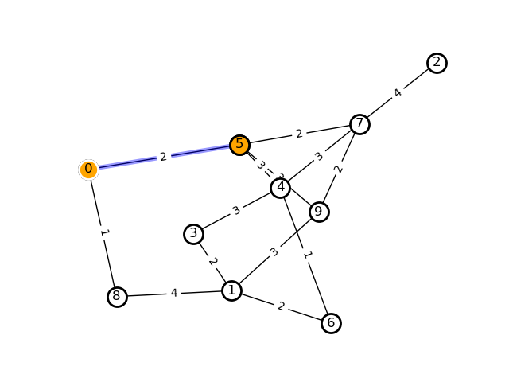

# 第四回 アルゴリズム
* 実験年月日 2018/06/18
* 提出年月日 2018/06/18
* 班番号 6
* 報告者 3年19番6班 末田 貴一
* 共同実験者
    * 7番 川上 求
    * 42番 山崎 敦史
    * 47番 ロンサン
## 問題4.1
### ソースコード
```
def sort_by_bubble(lst):
    # リストlstを昇順でバブルソートによってソートする

    list_size=len(lst)
    for j in range (list_size):
        for i in range (list_size-j-1):
            if(lst[i]>lst[i+1]):
                s=lst[i]
                lst[i]=lst[i+1]
                lst[i+1]=s
    
    return lst

# 使用する

## テスト用の配列hoge_list
hoge_list=[3,2,5,1,4]

## sort_by_bubble使用，表示
hoge_bubble=sort_by_bubble(hoge_list)
print("sort_by_bubble:"+str(hoge_bubble))

## チェック用にsortedメソッドを用いてソート，ソート結果をhoge_sortedに格納→表示
hoge_sorted=sorted(hoge_list)
print("sorted():"+str(hoge_sorted))

```
### 実行結果
```
$>python 4_1.py
sort_by_bubble:[1, 2, 3, 4, 5]
sorted():[1, 2, 3, 4, 5]

$>
```
## 問題4.2
### pythonで表示→ソースコード
```
mat = [
    [0,0,0,0,0,2,0,0,1,0],
    [0,0,0,2,0,0,2,0,4,3],
    [0,0,0,0,0,0,0,4,0,0],
    [0,2,0,0,3,0,0,0,0,0],
    [0,0,0,3,0,3,1,3,0,0],
    [2,0,0,0,3,0,0,2,0,3],
    [0,2,0,0,1,0,0,0,0,0],
    [0,0,4,0,3,2,0,0,0,2],
    [1,4,0,0,0,0,0,0,0,0],
    [0,3,0,0,0,3,0,2,0,0]
]

for i in range(9):
    print(str(mat[i]))

```
### 実行結果
```
$>python 4_2.py
[0, 0, 0, 0, 0, 2, 0, 0, 1, 0]
[0, 0, 0, 2, 0, 0, 2, 0, 4, 3]
[0, 0, 0, 0, 0, 0, 0, 4, 0, 0]
[0, 2, 0, 0, 3, 0, 0, 0, 0, 0]
[0, 0, 0, 3, 0, 3, 1, 3, 0, 0]
[2, 0, 0, 0, 3, 0, 0, 2, 0, 3]
[0, 2, 0, 0, 1, 0, 0, 0, 0, 0]
[0, 0, 4, 0, 3, 2, 0, 0, 0, 2]
[1, 4, 0, 0, 0, 0, 0, 0, 0, 0]

$>
```
## 問題4.3
### ソースコード
```
import matplotlib.pyplot as plt
import networkx as nx
import numpy as np

def get_minimum_weight_node(weights, candidates):
    # 候補ノード番号リストcandidatesの中から，最小となる重みweights[x]を持つノード番号xを返す

    min_cand = -1
    min_weight = float('inf')

    for x in candidates:
        if(min_weight > weights[x]):

            min_cand = x
            min_weight = weights[x]

    print(candidates, min_cand, weights)

    return min_cand


def get_path_by_djikstra(matrix, start_node):
    # 隣接行列matrixによって表されるグラフ上で，始点番号start_nodeから始まる各ノードへの最短パスに含まれるエッジリストをダイクストラ法で求めて返す。

    g_size = len(matrix)

    weights = [float('inf')] * g_size # 重みリストを無限大で初期化
    selected_edges = [-1] * g_size # 接続先リストを無接続(-1)で初期化
    
    weights[start_node] = 0 # 始点ノードの重みを0にする
    next_nodes = list(range(g_size)) # 起点ノードリストを[0,1,2,…,g_size-1]で初期化

    while(next_nodes): # 起点ノードリストが空でないならば
        
        x = get_minimum_weight_node(weights, next_nodes) # 起点ノードリストから最小重みのノードを取り出す
        next_nodes.remove(x)

        for n in range(g_size):
            if(matrix[x][n] != 0):
                if(weights[n] > matrix[x][n] + weights[x]):

                    weights[n] = matrix[x][n] + weights[x] # 重みの更新
                    selected_edges[n] = [x,n] # 接続元リストをノードの組リストで更新

    for j in range(g_size):
        if(-1 in selected_edges):
            selected_edges.remove(-1)
        else:
            break

    return selected_edges

def display_graph_from_matrix(matrix, path, start_node, end_node):
    # 隣接行列を表すmatrixと色を変えたいエッジリストpath，および色を変えたい始点番号start_node，終点番号end_nodeを使って，グラフを描画する。

    adj_mat = np.asmatrix(matrix)

    G = nx.convert_matrix.from_numpy_matrix(adj_mat,create_using=nx.Graph())
    pos = nx.spring_layout(G)

    allnodes = nx.draw_networkx_nodes(G, pos, node_color='white')
    allnodes.set_edgecolor('black')
    allnodes.set_linewidth(2.0)
    tnode = nx.draw_networkx_nodes(G, pos, nodelist=[end_node], node_color='orange')
    tnode.set_edgecolor('black')
    tnode.set_linewidth(2.0)
    snode = nx.draw_networkx_nodes(G, pos, nodelist=[start_node], node_color='orange')
    snode.set_edgecolor('white')
    snode.set_linewidth(2.0)
    nx.draw_networkx_labels(G, pos)
    nx.draw_networkx_edges(G, pos)
    nx.draw_networkx_edges(G, pos, edgelist=path, edge_color='blue', alpha=0.4, width=4)

    edge_labels = nx.get_edge_attributes(G, 'weight')
    nx.draw_networkx_edge_labels(G, pos, edge_labels=edge_labels)

    plt.axis('off')
    plt.show()

if(__name__ == '__main__'):
    
    start_node = 0
    goal_node = 5

    mat=[
        [0,0,0,0,0,2,0,0,1,0],
        [0,0,0,2,0,0,2,0,4,3],
        [0,0,0,0,0,0,0,4,0,0],
        [0,2,0,0,3,0,0,0,0,0],
        [0,0,0,3,0,3,1,3,0,0],
        [2,0,0,0,3,0,0,2,0,3],
        [0,2,0,0,1,0,0,0,0,0],
        [0,0,4,0,3,2,0,0,0,2],
        [1,4,0,0,0,0,0,0,0,0],
        [0,3,0,0,0,3,0,2,0,0]
    ]

    print("mat"+str(mat))

    paths = get_path_by_djikstra(mat, start_node) # 最短経路を構築するパスリストを計算
    print(str(paths))

    display_graph_from_matrix(mat, paths, start_node, goal_node) # グラフとパスリストの表示

```
### 実行結果
```
$>python 4_3.py
mat[[0, 0, 0, 0, 0, 2, 0, 0, 1, 0], [0, 0, 0, 2, 0, 0, 2, 0, 4, 3], [0, 0, 0, 0, 0, 0, 0, 4, 0, 0], [0, 2, 0, 0, 3, 0, 0, 0, 0, 0], [0, 0, 0, 3, 0, 3, 1, 3, 0, 0], [2, 0, 0, 0, 3, 0, 0, 2, 0, 3], [0,
2, 0, 0, 1, 0, 0, 0, 0, 0], [0, 0, 4, 0, 3, 2, 0, 0, 0, 2], [1, 4, 0, 0, 0, 0, 0, 0, 0, 0], [0, 3, 0, 0, 0, 3, 0, 2, 0, 0]]
[0, 1, 2, 3, 4, 5, 6, 7, 8, 9] 0 [0, inf, inf, inf, inf, inf, inf, inf, inf, inf]
[1, 2, 3, 4, 5, 6, 7, 8, 9] 8 [0, inf, inf, inf, inf, 2, inf, inf, 1, inf]
[1, 2, 3, 4, 5, 6, 7, 9] 5 [0, 5, inf, inf, inf, 2, inf, inf, 1, inf]
[1, 2, 3, 4, 6, 7, 9] 7 [0, 5, inf, inf, 5, 2, inf, 4, 1, 5]
[1, 2, 3, 4, 6, 9] 1 [0, 5, 8, inf, 5, 2, inf, 4, 1, 5]
[2, 3, 4, 6, 9] 4 [0, 5, 8, 7, 5, 2, 7, 4, 1, 5]
[2, 3, 6, 9] 9 [0, 5, 8, 7, 5, 2, 6, 4, 1, 5]
[2, 3, 6] 6 [0, 5, 8, 7, 5, 2, 6, 4, 1, 5]
[2, 3] 3 [0, 5, 8, 7, 5, 2, 6, 4, 1, 5]
[2] 2 [0, 5, 8, 7, 5, 2, 6, 4, 1, 5]
[[8, 1], [7, 2], [1, 3], [5, 4], [0, 5], [4, 6], [5, 7], [0, 8], [5, 9]]

$>
```

## 問題4.4
### ソースコード
```
import matplotlib.pyplot as plt
import networkx as nx
import numpy as np

def get_minimum_weight_node(weights, candidates):
    # 候補ノード番号リストcandidatesの中から，最小となる重みweights[x]を持つノード番号xを返す

    min_cand = -1
    min_weight = float('inf')

    for x in candidates:
        if(min_weight > weights[x]):

            min_cand = x
            min_weight = weights[x]

    print(candidates, min_cand, weights)

    return min_cand


def get_path_by_djikstra(matrix, start_node):
    # 隣接行列matrixによって表されるグラフ上で，始点番号start_nodeから始まる各ノードへの最短パスに含まれるエッジリストをダイクストラ法で求めて返す。

    g_size = len(matrix)

    weights = [float('inf')] * g_size # 重みリストを無限大で初期化
    selected_edges = [-1] * g_size # 接続先リストを無接続(-1)で初期化
    
    weights[start_node] = 0 # 始点ノードの重みを0にする
    next_nodes = list(range(g_size)) # 起点ノードリストを[0,1,2,…,g_size-1]で初期化

    while(next_nodes): # 起点ノードリストが空でないならば
        
        x = get_minimum_weight_node(weights, next_nodes) # 起点ノードリストから最小重みのノードを取り出す
        next_nodes.remove(x)

        for n in range(g_size):
            if(matrix[x][n] != 0):
                if(weights[n] > matrix[x][n] + weights[x]):

                    weights[n] = matrix[x][n] + weights[x] # 重みの更新
                    selected_edges[n] = [x,n] # 接続元リストをノードの組リストで更新

    for j in range(g_size):
        if(-1 in selected_edges):
            selected_edges.remove(-1)
        else:
            break

    return selected_edges

def display_graph_from_matrix(matrix, path, start_node, end_node):
    # 隣接行列を表すmatrixと色を変えたいエッジリストpath，および色を変えたい始点番号start_node，終点番号end_nodeを使って，グラフを描画する。

    adj_mat = np.asmatrix(matrix)

    G = nx.convert_matrix.from_numpy_matrix(adj_mat,create_using=nx.Graph())
    pos = nx.spring_layout(G)

    allnodes = nx.draw_networkx_nodes(G, pos, node_color='white')
    allnodes.set_edgecolor('black')
    allnodes.set_linewidth(2.0)
    tnode = nx.draw_networkx_nodes(G, pos, nodelist=[end_node], node_color='orange')
    tnode.set_edgecolor('black')
    tnode.set_linewidth(2.0)
    snode = nx.draw_networkx_nodes(G, pos, nodelist=[start_node], node_color='orange')
    snode.set_edgecolor('white')
    snode.set_linewidth(2.0)
    nx.draw_networkx_labels(G, pos)
    nx.draw_networkx_edges(G, pos)
    nx.draw_networkx_edges(G, pos, edgelist=path, edge_color='blue', alpha=0.4, width=4)

    edge_labels = nx.get_edge_attributes(G, 'weight')
    nx.draw_networkx_edge_labels(G, pos, edge_labels=edge_labels)

    plt.axis('off')
    plt.show()

if(__name__ == '__main__'):
    
    start_node = 0
    goal_node = 5

    mat=[
        [0,0,0,0,0,2,0,0,1,0],
        [0,0,0,2,0,0,2,0,4,3],
        [0,0,0,0,0,0,0,4,0,0],
        [0,2,0,0,3,0,0,0,0,0],
        [0,0,0,3,0,3,1,3,0,0],
        [2,0,0,0,3,0,0,2,0,3],
        [0,2,0,0,1,0,0,0,0,0],
        [0,0,4,0,3,2,0,0,0,2],
        [1,4,0,0,0,0,0,0,0,0],
        [0,3,0,0,0,3,0,2,0,0]
    ]

    print("mat"+str(mat))

    paths = get_path_by_djikstra(mat, start_node) # 最短経路を構築するパスリストを計算
    print(str(paths))
    for i in range(int(len(paths))):
        if(paths[i][0]==start_node and paths[i][1]==goal_node):
            cache=paths[i]
            paths=[[0]*8 for i in range(8)]
            paths[0]=cache
            break
    
    display_graph_from_matrix(mat, paths, start_node, goal_node) # グラフとパスリストの表示

```
### 実行結果
```
$>python 4_4.py
mat[[0, 0, 0, 0, 0, 2, 0, 0, 1, 0], [0, 0, 0, 2, 0, 0, 2, 0, 4, 3], [0, 0, 0, 0, 0, 0, 0, 4, 0, 0], [0, 2, 0, 0, 3, 0, 0, 0, 0, 0], [0, 0, 0, 3, 0, 3, 1, 3, 0, 0], [2, 0, 0, 0,
3, 0, 0, 2, 0, 3], [0, 2, 0, 0, 1, 0, 0, 0, 0, 0], [0, 0, 4, 0, 3, 2, 0, 0, 0, 2], [1, 4, 0, 0, 0, 0, 0, 0, 0, 0], [0, 3, 0, 0, 0, 3, 0, 2, 0, 0]]
[0, 1, 2, 3, 4, 5, 6, 7, 8, 9] 0 [0, inf, inf, inf, inf, inf, inf, inf, inf, inf]
[1, 2, 3, 4, 5, 6, 7, 8, 9] 8 [0, inf, inf, inf, inf, 2, inf, inf, 1, inf]
[1, 2, 3, 4, 5, 6, 7, 9] 5 [0, 5, inf, inf, inf, 2, inf, inf, 1, inf]
[1, 2, 3, 4, 6, 7, 9] 7 [0, 5, inf, inf, 5, 2, inf, 4, 1, 5]
[1, 2, 3, 4, 6, 9] 1 [0, 5, 8, inf, 5, 2, inf, 4, 1, 5]
[2, 3, 4, 6, 9] 4 [0, 5, 8, 7, 5, 2, 7, 4, 1, 5]
[2, 3, 6, 9] 9 [0, 5, 8, 7, 5, 2, 6, 4, 1, 5]
[2, 3, 6] 6 [0, 5, 8, 7, 5, 2, 6, 4, 1, 5]
[2, 3] 3 [0, 5, 8, 7, 5, 2, 6, 4, 1, 5]
[2] 2 [0, 5, 8, 7, 5, 2, 6, 4, 1, 5]
[[8, 1], [7, 2], [1, 3], [5, 4], [0, 5], [4, 6], [5, 7], [0, 8], [5, 9]]

$>
```

## レポート課題
### 4.1
> バブルソート以外のソートアルゴリズムを一つ調べ，アルゴリズムをまとめよ。
> またプログラムを書き，動作確認をせよ。

クイックソートがある。
#### ソースコード
```
def quick_sort(arr):
    hidari = []
    migi = []
    if len(arr) <= 1:
        return arr
    
    ref = arr[0]
    ref_count = 0

    for ele in arr:
        if ele < ref:
            hidari.append(ele)
        elif ele > ref:
            migi.append(ele)
        else:
            ref_count += 1
    hidari = quick_sort(hidari)
    migi = quick_sort(migi)
    return hidari + [ref] * ref_count + migi

arr = [3,2,5,1,4]
print(str(arr))

arr = quick_sort(arr)
print(str(arr))

```

#### 実行結果
```
$>python quick.py
[3, 2, 5, 1, 4]
[1, 2, 3, 4, 5]

$>
```

### 4.2
> 人がソートを実行する際に最も効率が良いソートアルゴリズムはなにか。
> 調査して理由を自分なりに説明してまとめよ。
#### 結論
基数ソート
#### 理由
”本当に実用的なたったひとつのソートアルゴリズム”というページで64枚の数字の書かれたカードを
様々なソートアルゴリズムを人力で実行してその速度を競っていました。
比較されていたソートは5つで，
1. 挿入ソート
2. クイックソート
3. マージソート
4. 基数ソート
5. 鳩の巣ソート

でした。
順位は
1位：鳩の巣ソート
2位：基数ソート
3位：挿入ソート
4位：クイックソート
5位：マージソート
でした。

また，”これは何ソートって呼ぶのかな”という記事では
二桁のユニーク数字が割り振られた証券100枚を順番に並べる際のソートアルゴリズムを自作された方の話で，
自作した結果，そのソートが基数ソートであることがコメント欄にて判明しています。
この方の場合は視覚障害がある方との共同作業だったようでそういった方でも短時間でソートできることを目的としたようです。

またwikipedia.orgの基数ソートのページを参照すると，「比較によらないソート」として紹介されていました。

以上のことから基数ソートが人間の脳のリソースを最も消費せずに早くソートできるソートアルゴリズムだと考えます。
#### 参考
https://techlog.voyagegroup.com/entry/2015/08/17/182516
http://d.hatena.ne.jp/tt4cs/20111117/1321530953
https://ja.wikipedia.org/wiki/基数ソート
### 4.3
> カーナビなどの実際の経路探索機能では，経由地が設定できることが多い。
> 経由地を設定できるようにプログラムを変更する場合，どのように変更すればよいか。
> 調査して理由を自分なりに説明してまとめよ。

始点と終点から経由地を同時に探索することで中間の経由地点ノードを通過する最短ルートを検索できる。
#### 参考
http://db-event.jpn.org/deim2015/paper/133.pdf
