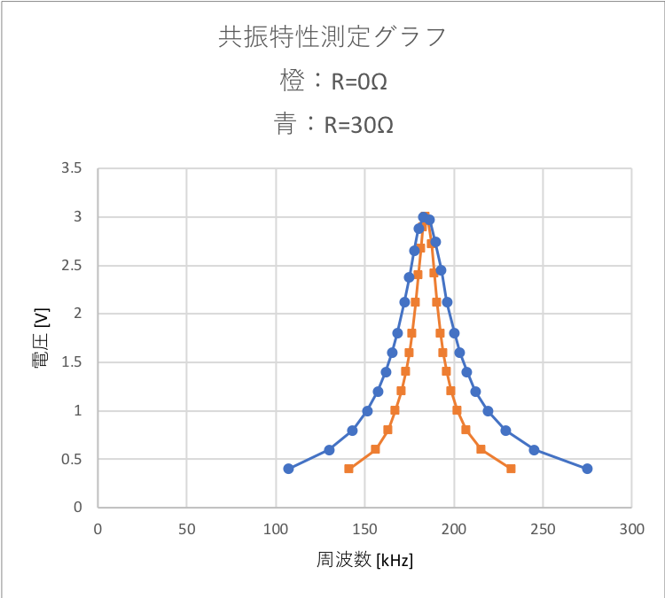
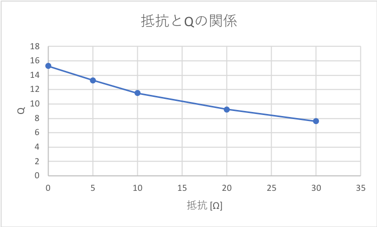

# 2018/07/09 LC共振特性の測定
## issue
* 式番号よこせ←解決 2018/07/24
----
* 式番号よこせ2←解決 2018/07/27
    * 式番号は()でかこむ
* ベクトル図の二個目のVが違う←解決 2018/07/28
* ベクトル**図**なので直下にタイトルと説明が要るお←解決 2018/07/28
* 図とグラフ説明レス←解決
* 図とグラフを文章で示す←解決
* 図とグラフの単位が無いお←ある気がする
## 目的
LC共振特性の測定を行い，共振の原理を知るとともに共振鋭度Qについて理解する。
## 実験内容
共振特性の測定
### 使用機器
* 周波数カウンタ・発振器(ファンクション・ジェネレータ)
* 検出用電圧計
* 可変抵抗器
* コンデンサ
* コイル
## 解説
抵抗$R$[Ω]，インダクタンス$L$[H]，静電容量$C$[F]を直列に接続した回路に交流電圧を加えると，回路には電流$I$[A]が流れ，各素子両端の電圧は
> $V$$R$$=RI$
> 
> $V$$L$$=ωLI$
> 
> $V$$C$$={\frac{I}{ωC}}$
> 
>  
(1)

となる。
このとき，各素子に流れる電流$I$は共通であるから，電流$I$を基準に書くと($V$$L$$>V$Cの場合)$V$Rは$I$と同相で，$V$$L$は$I$より${\frac{π}{2}}$[rad]進み，$V$$C$は$I$より${\frac{π}{2}}$[rad]遅れることになる。
そして，それぞれの電圧を加えた値は，次式のようになる。
> $V=\sqrt{(RI)^2+(ωLI-\frac{1}{ωC}I)}=\sqrt{R^2+(ωL-\frac{1}{ωC})^2}×I$
> 
>  
(2)

よってこの回路のインピーダンス$Z$[Ω]は，
> $Z=\frac{V}{I}=\sqrt{R^2+(ωL-\frac{1}{ωC})^2}$
> 
>  
(3)

と表すことができる。
この回路の周波数$f$を変化させると，$ω=2πf$なので，$ωL=\frac{1}{ωC}$になる周波数$f$$0$[Hz]が存在する。
このとき，
> $Z\sqrt{R^2+(ωL-\frac{1}{ωC})^2}=\sqrt{R^2+(0)^2}=R$
> 
>  
(4)

となり，ZはRだけが残って最小となり，電流は，
> $I$$0$$=\frac{V}{Z}=\frac{V}{R}$
> 
>  
(5)

で最大の値をとる。
この$f_0$を共振周波数といい，この状態を共振という。
共振しているときは$ωL=\frac{1}{ωC}$より$ω^2=\frac{1}{LC}$であり，共振周波数は，
> $f_0=\frac{1}{2π\sqrt{LC}}$
> 
>  
(6)

と表すことができる。
共振時の$V$$L$と$V$$C$($V$$L$$=V$$C$)を考えると，$I=\frac{V}{R}$より
> $V_L=\frac{ωLV}{R}$
> 
> $\frac{V_L}{V}=\frac{ωL}{R}$
> 
> $V_c=\frac{V}{ωCR}$
> 
> $\frac{V_c}{V}=\frac{1}{ωCR}$
> 
>  
(7)

と表すことができる。
この$\frac{V_L}{V}$は$Q$と呼ばれ，$Q$は共振時に$V_L$や$V_C$電源電圧の何倍になるかを表しており，共振鋭度と呼ばれる。
$Q$はこの共振特性のグラフからも求めることができる。
> $Q=\frac{f_0}{Δf}$
> 
>  
(8)

## 実験方法
### 簡単な回路の測定
1. 実験書の図6のように回路を組む。接続した乾電池の電圧と，それぞれの抵抗の端子電圧を測定する。(0 Hz)
2. 実験書の図7のように乾電池の代わりに発振器を接続し，発振器の周波数を変化させ，それぞれの抵抗の両端電圧を測定する。発振器の電圧は1 Vとし，次の周波数における電圧を測定する
    * 5.77 kHz
    * 10.00 kHz
    * 17.32 kHz
3. 実験書の図6において，2つの抵抗の代わりに抵抗とコンデンサが直列接続された回路を接続し，(1)と同様に乾電池の電圧と抵抗，コンデンサのそれぞれの端子の電圧を測定する。(0 Hzの電源と等価)
4. 同様に乾電池の代わりに発振器を接続し，発振器の周波数を変化させ，抵抗とコンデンサそれぞれの端子電圧を測定する。また，オシロスコープを用いて，発振器を信号と各端子電圧の信号を測定し，位相を確認する。
### 共振特性の測定
1. 実験書の図8のように回路を作成し，$R$を0 Ωとしておく。また，こんでんさ の値をメモしておく。
2. 発振器の周波数を変化させ，コンデンサの電圧(電圧計$V$で読み取る)が最大になる周波数(共振周波数$f_0$)を求める。
3. $f_0$のときコンデンサの電圧が3.00Vになるように，発振器のAMPLITUDEで出力電圧を調整する。
4. コンデンサの電圧が$\frac{3}{\sqrt{2}}$[V] (2.12V) なる周波数$f_0$の上下両端周波数$f_1$，$f_2$を求める。
5. $f_0$から$f_1$を4等分した周波数のときの各周波数とコンデンサの電圧を測定して記録する。
6. $f_0$から$f_2$を4等分した周波数のときの各周波数とコンデンサの電圧を測定して記録する。
7. $f_0$の上下両端について以下の電圧になる周波数を測定，記録する。
    * 1.40
    * 1.20
    * 1.00
    * 0.80
    * 0.60
    * 0.40
8. $R$を30 Ωに変えて(2)〜(7)を行う
9. 共振回路の抵抗を変えたときの$Q$を求めるために，$R$を5 Ωとし(2)(3)を行う。
10. コンデンサの電圧が$\frac{3}{\sqrt{2}}$[V] (2.12v)となる周波数を$f_0$の上下両側$f_1$，$f_2$について求める。
11. $R$を10Ω，20Ωと変えて，その都度(2)，(3)，(10)を行う。
## 実験結果
### 抵抗回路の測定結果
抵抗回路の測定結果を表5.1に示す。

表5.1 抵抗回路の測定結果

| 乾電池電圧 $E$[V]または発振器電圧[V] | 周波数 [kHz] | $V_r1$ [V] | 発振器電圧と$V_r1$ [V]の位相 [度] | $V_r2$ [V] | 発振器電圧と$V_r2$ [V]の位相 [度] |
|------------------------------------|--------------|----------|---------------------------------|----------|---------------------------------|
| 1.558                              |              | 0.776    |                                 | 0.778    |                                 |
| 1                                  | 5.77         | 0.52     | 0                               | 0.51     | 0                               |
| 1                                  | 10           | 0.53     | 0                               | 0.51     | 0                               |
| 1                                  | 17.32        | 0.561    | 6                               | 0.502    | 0                               |
### CR回路の測定結果
CR回路の測定結果を表5.2に示す。

表5.2 CR回路の測定結果

| 乾電池電圧 $E$[V]または発振器電圧[V] | 周波数 [kHz] | $V_r$ [V] | 発振器電圧と$V_r$ [V]の位相 [度] | $V_C$ [V] | 発振器電圧と$V_C$ [V]の位相 [度] |
|--------------------------------------|--------------|-----------|----------------------------------|-----------|----------------------------------|
| 1.558                                |              | 0         |                                  | 1.556     |                                  |
| 1                                    | 5.77         | 0.482     | 0                                | 0.781     | 32                               |
| 1                                    | 10           | 0.66      | 0                                | 0.61      | 48                               |
| 1                                    | 17.32        | 0.79      | 0                                | 0.45      | 66                               |
### 共振特性測定結果
共振特性の測定結果を表5.3に示す。

表5.3 共振特性の測定結果

| 0Ω           |          | 5Ω           |          | 10Ω          |          | 20Ω          |          | 30Ω          |          |
|--------------|----------|--------------|----------|--------------|----------|--------------|----------|--------------|----------|
| 周波数 [kHz] | 電圧 [V] | 周波数 [kHz] | 電圧 [V] | 周波数 [kHz] | 電圧 [V] | 周波数 [kHz] | 電圧 [V] | 周波数 [kHz] | 電圧 [V] |
| 141          | 0.4      |              | 0.4      |              | 0.4      |              | 0.4      | 107          | 0.4      |
| 156          | 0.6      |              | 0.6      |              | 0.6      |              | 0.6      | 130          | 0.6      |
| 163          | 0.8      |              | 0.8      |              | 0.8      |              | 0.8      | 143          | 0.8      |
| 167          | 1        |              | 1        |              | 1        |              | 1        | 151.3        | 1        |
| 170.8        | 1.2      |              | 1.2      |              | 1.2      |              | 1.2      | 157.3        | 1.2      |
| 173.1        | 1.4      |              | 1.4      |              | 1.4      |              | 1.4      | 161.8        | 1.4      |
| 174.9        | 1.6      |              | 1.6      |              | 1.6      |              | 1.6      | 165.3        | 1.6      |
| 176.4        | 1.8      |              | 1.8      |              | 1.8      |              | 1.8      | 168.2        | 1.8      |
| 178.6        | 2.12     | 177.6        | 2.12     | 176.4        | 2.12     | 174.4        | 2.12     | 172.1        | 2.12     |
| 179.95       | 2.4      |              |          |              |          |              |          | 174.825      | 2.38     |
| 181.3        | 2.67     |              |          |              |          |              |          | 177.55       | 2.65     |
| 182.65       | 2.89     |              |          |              |          |              |          | 180.275      | 2.88     |
| 184          | 3        | 184          | 3        | 184          | 3        | 184          | 3        | 183          | 3        |
| 185.65       | 2.96     |              |          |              |          |              |          | 186.3        | 2.97     |
| 187.3        | 2.72     |              |          |              |          |              |          | 189.6        | 2.74     |
| 188.95       | 2.42     |              |          |              |          |              |          | 192.9        | 2.45     |
| 190.6        | 2.12     | 191.4        | 2.12     | 192.4        | 2.12     | 194.3        | 2.12     | 196.2        | 2.12     |
| 192.7        | 1.8      |              | 1.8      |              | 1.8      |              | 1.8      | 200.3        | 1.8      |
| 194.2        | 1.6      |              | 1.6      |              | 1.6      |              | 1.6      | 203.4        | 1.6      |
| 196.2        | 1.4      |              | 1.4      |              | 1.4      |              | 1.4      | 207.2        | 1.4      |
| 198.6        | 1.2      |              | 1.2      |              | 1.2      |              | 1.2      | 212.1        | 1.2      |
| 202          | 1        |              | 1        |              | 1        |              | 1        | 218.9        | 1        |
| 206.8        | 0.8      |              | 0.8      |              | 0.8      |              | 0.8      | 229          | 0.8      |
| 215.2        | 0.6      |              | 0.6      |              | 0.6      |              | 0.6      | 245          | 0.6      |
| 232.2        | 0.4      |              | 0.4      |              | 0.4      |              | 0.4      | 275          | 0.4      |
### $R=0$，$30$ Ωにおける共振特性測定グラフ
$R=0$，$30$ Ωにおける共振特性測定グラフをグラフ5.4に示す。

グラフ5.4 共振特性測定グラフ

### 各抵抗におけるQの測定結果
各抵抗におけるQの測定結果を表5.5に示す。

表5.5 各抵抗におけるQの測定結果

| 抵抗値 [Ω] | 共振周波数 [kHz] | $Δf$ | $Q$ 共振鋭度 |
|------------|------------------|------|--------------|
| 0          | 184              | 12   | 15.3         |
| 5          | 184              | 13.8 | 13.3         |
| 10         | 184              | 16   | 11.5         |
| 20         | 184              | 19.9 | 9.25         |
| 30         | 183              | 24.1 | 7.6          |
### 抵抗と$Q$の関係
各抵抗値($R=0,5,10,20,30$ Ω)と$Q$の関係をグラフ5.6に示す。

グラフ5.6 各抵抗値の関係

## 考察
1. 実験4.1から直流回路においてCR回路に電流は流れるかどうか，説明せよ。
2. 実験4.1から交流回路においてコンデンサの抵抗値(インピーダンス)は電源の周波数の変化によってどのように変わると考えられるか，説明せよ。
3. 実験4.1の結果に基づいて，交流回路においても以下のキルヒホッフ第2法則が成り立つことをベクトル図により示せ。
> $E=V_r1+V_r2$
> $E=V_r+V_c$
> 
>  
(9)

4. 実験4.2の結果から，$R$の値の増減が$Q$の値にどのような影響を与えるか，考察せよ。
5. 実験4.2の結果から$Q$の値が蔵点すると共振特性がどのように変化するか，説明せよ
6. 実験4.2の結果から，イン学タンス$L$ の値を計算せよ。
7. 今回の実験から，自分が理解できたことを報告せよ。
### 実験4.1から直流回路においてCR回路に電流は流れるかどうか，説明せよ。
実験の結果からCR回路の$V_c$は発振器電圧との位相のズレがあり，発振器の周波数[kHz]が大きくなるにつれて位相のズレも大きくなっている。
### 実験4.1から交流回路においてコンデンサの抵抗値(インピーダンス)は電源の周波数の変化によってどのように変わると考えられるか，説明せよ。
オームの法則より
> $R=\frac{V}{I}$
> 
>  
(10)

であり，周波数が大きくなると$V_c$は小さくなっているため，電源の周波数が大きくなるとコンデンサの抵抗値(インピーダンス)は小さくなると考えられる。
### 実験4.1の結果に基づいて，交流回路においても以下のキルヒホッフ第2法則が成り立つことをベクトル図により示せ。
> $E=V_r1+V_r2$
> $E=V_r+V_c$
> 
>  
(11)

式(11)を表すベクトル図をそれぞれ図6.3.1と図6.3.2に示す
参考文献番号：1

図6.3.1 式(11)の1つ目の式を表すベクトル図

図6.3.2 式(11)の2つ目の式を表すベクトル図

### 実験4.2の結果から，$R$の値の増減が$Q$の値にどのような影響を与えるか，考察せよ。
グラフ5.6より抵抗値の増加はQの減少をともなっている。

### 実験4.2の結果から$Q$の値が増減すると共振特性がどのように変化するか，説明せよ
Qつまり共振鋭度が小さくなればなるほど抵抗は大きくなり，グラフ5.4のように抵抗が大きくなると横軸でとる範囲が広くなる。

### 実験4.2の結果から，インダクタンス$L$の値を計算せよ。
> $f_0=\frac{1}{2\pi\sqrt{LC}}$
> 
> $f_02\pi\sqrt{LC}=1$
> 
> $\sqrt{LC}=\frac{1}{f_02\pi}$
> 
> $LC=(\frac{1}{f_02\pi})^2$
> 
> $L=\frac{(\frac{1}{f_02\pi})^2}{C}$
> 
>  
(12)

### 今回の実験から，自分が理解できたことを報告せよ。
周波数が電圧などに影響することで抵抗が変動し，その抵抗の変化が共振鋭度に影響するということが分かった。
## 参考
|参考文献番号|タイトル|URL|閲覧日時|
|--------|--------|--------|--------|
|1|交流回路のベクトル図|http://d.hatena.ne.jp/kouryu07/20070512|2018/07/22|
