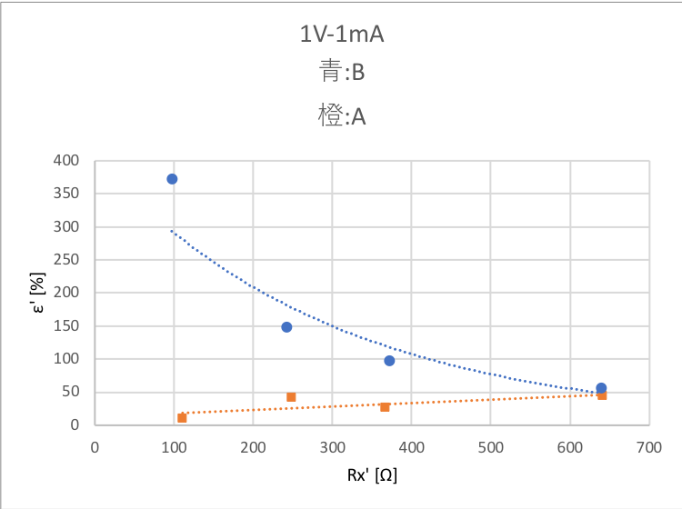
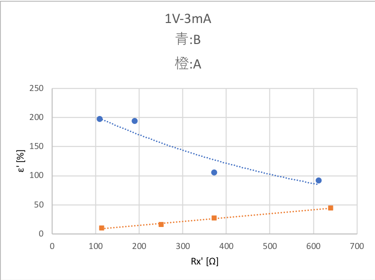
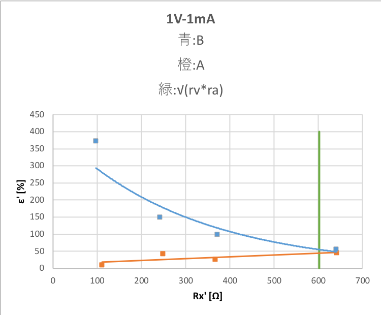
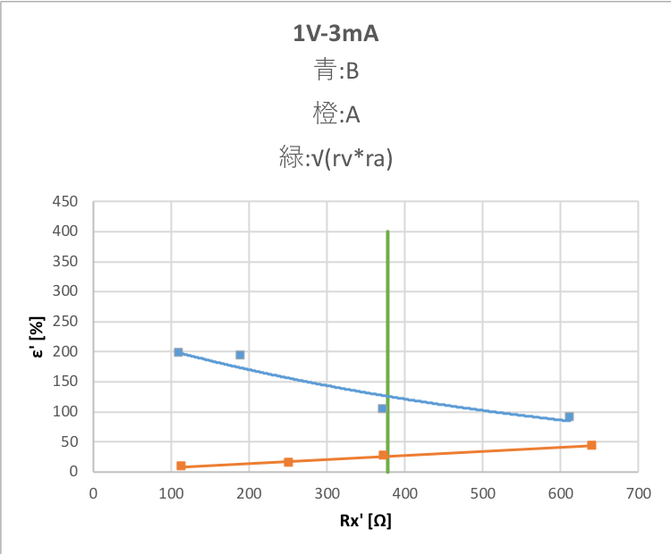
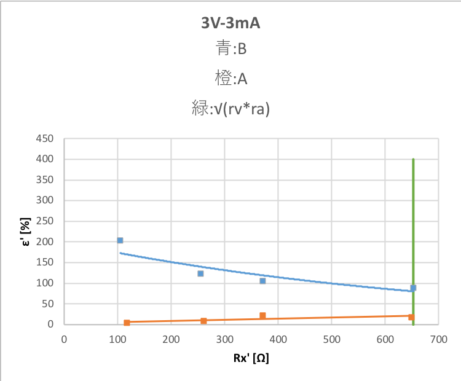

# 2018/07/02 電位降下法・置換法による中位抵抗の測定
## issue
* 表番号，図番号が無い←解決 2018/07/16
    * 説明文が無い
    * 軸の単位(軸タイトル ラベル)が無い
* 参考文献は参考にした箇所に参考文献番号を書く←解決 2018/07/16
    * 参考文献はページタイトル，URL，閲覧日時(年月日)
----
* 表タイトルの修正←解決 2018/07/24
* 参考文献番号を適当に←解決 2018/07/24
----
* 表と図の違いの認識←解決 2018/07/27
    * グラフは図なのでタイトルとかは下に書く
    * 表はその上に書く
* 文章から図やグラフを示す←解決 2018/07/27
    * 文章で図，表の説明をする
    * 図タイトルなどのとなりに図の説明を書く 
* 後半のグラフと表に単位が無いんだけど←解決 2018/07/27
## 目的
実験を行ってデータを収集し整理する場合，守るべき原則や注意事項がある。

この実験では数十から数百オームの中位抵抗の測定を通して次のことを確認する。
* アナログ計器の読み方(計器板の鏡の使い方，スケール切り替えの必要性)
* 有効数字の取扱(データ読み取り時，計算時)
* 計器の内部抵抗の影響
* 表とグラフの書き方

## 原理・解説・実験方法
### 基本事項の確認
実験を行ってデータを取る前に確認しておかなければならない事項がある。

ここではその確認を行う。

次の1〜3の確認事項を担当教員に必ずチェックしてもらうこと。
1. アナログ計器板にある鏡の意味を理解する。(なぜ鏡があるのか)
2. 有効数字に注意しながら，次の2つのデータを使ってオームの法則により抵抗値を計算すると，抵抗値はいくらか。また，有効数字はいくらか。
    * ある抵抗に0.002[A]の電流が流れたとき，1.1[V]の電圧がかかっていた。
    * ある抵抗に0.00211[A]の電流が流れたとき，1.1[V]の電圧がかかっていた。
3. 上の2つの結果からなぜ針ができるだけ大きく振れるように計器のスケールを切り替える必要があるのか，なぜメモリの1/10まで目分量でデータをとらなければならないのか，理由を考えて説明せよ。

### 置換法による中位抵抗の測定
#### 置換法による測定の原理
電源，保護抵抗，電流計，スイッチ，未知抵抗を接続し，スイッチを道抵抗側に倒し，電流を流す。

ことのときの電流値Iを測定し，次にスイッチを既知抵抗に切り替えて電流を流す。

既知抵抗側に切り替えて電流を流す。このとき既知抵抗の値を切り替えて調整することにより，電流計を流れる電流値の値を最初のIと同じにする。

このとき未知抵抗の値Rxと既知抵抗Rは互いに等しくなり，Rxの値を知ることができる。
#### 実験方法

1. 測定回路を実験書を参考にして構成する。置換法によって各未知抵抗の値を測定する。実験方法の詳細は測定の原理をもとに各自で考えること。ただし，測定値には必ず誤差が含まれるため，未知抵抗1個につき電流Iの値を3回(大，中，小)変えて測定し，その平均をとって真の抵抗値を推定すること。
2. 上記の1の測定値において，3回のうち1回の測定値が他の2回と著しく異なっていた場合，どのように処置したらよいか考え説明せよ。
3. 実際に上記の2に該当するデータが測定されていれば，2で考えた適切な処置を施すこと。

### 電位降下法による中位抵抗の測定
#### 電位降下法による測定の原理
抵抗に電流を流すと電位降下が発生する。

このとき，抵抗値R，電流値Iおよび電位降下の値Vの間でオームの法則が成り立つことがわかっている。
> V=RI

したがって，未知抵抗を流れる電流の値と未知抵抗の両端で発生している電位降下の値を測定すれば，上式を使って未知抵抗の値を計算で求めることができる。

電位降下法の測定回路は2つある。未知抵抗を流れる電流の値と未知抵抗の両端で発生している電位降下の値を測定するための回路としては，2つの種類が考えられるが，それぞれの回路では計器の内部抵抗の影響で，測定値が次の値となる。

* Aの回路
    * 電流計で測定された電流値は，電流計を流れる電流と道抵抗を流れる電流の和になっている。
* Bの回路
    * 電圧計で測定された電圧値は，電流計の内部抵抗による電位降下の値と道抵抗による電位降下の値の和になっている。

このため，A,Bの2つの回路とも，測定値をそのまま式に代入して計算したのでは未知抵抗の計算値と真の値との間に誤差が生じてしまう。

そこで，Aの回路では
> Rx=V/(I-(V/rv))

また，Bの回路では
> Rx=V/I-ra

```
Rx:未知抵抗
V:電圧
I:電流
rv:電圧計の内部抵抗
ra:電流計の内部抵抗
```

という補正式を使って未知抵抗の真の値Rxを推定する。

ただし，測定値には必ず誤差がふくまれるため，複数個の測定値の組み合わせを使って，このRxを計算し，その平均値Rx'を求めて真の抵抗値を推定する。

なお，このような補正を施したときの真の抵抗値Rx'に対する誤差率εは
> ε=((R-Rx')/Rx')*100 [%]

を用いて計算する。
#### 実験方法
1. ディジタルテスタを使って使用する電流計と電圧計の内部抵抗値を調べる。**内部抵抗の値は端子の組み合わせごとに値が異なるので**実験で使用するすべての端子の組み合わせについて調べること。
2. Aの測定回路を構成する。電圧計と電流計の端子の組み合わせを1V-1mAとする。
3. 各抵抗について，電流の値を段階的(大，中，小)に変えながら電圧値と電流値の組を3組測定する。測定する抵抗はNo.1~5まであるが，すべて測定すると時間が足らないと思われる場合は，最小値の抵抗を除く4種類の測定でも良い
4. 電圧計と電流計の組み合わせを1V-3mAに変更して3の測定を行う。
5. 電圧計と電流計の組み合わせを3V-3mAに変更して3の測定を行う。
6. Bの測定回路を構成し，Aの回路と同様に3~5の測定を行う。
## 実験結果
実験結果として次の内容を報告する。
1. 置換法に関する実験結果をまとめた表(測定データと推定される真の抵抗値)
2. 電位降下法の実験で利用した各景気の内部抵抗値をまとめた表。
3. 電位降下法に関する実験結果をまとめた表。表1に示す形式で両方の回路と測定したすべての未知抵抗について報告すること。
4. 電位降下法の実験における道抵抗と誤差率の関係を表すグラフ。端子の組み合わせのち外による誤差率の違いを比較するグラフを端子の組み合わせ(1V-1mA,1V-3mA,3V-3mA)ごとに各1枚ずつ合計3枚報告すること。また，Aの回路に関する誤差率のグラフはすべて最小二乗法を使って描き，係数を計算した家庭も報告すること。グラフの横軸はRx'縦軸はε'(|ε|の平均値)とする。
### 1 置換法に関する実験結果をまとめた表
置換法に関する実験結果を表3.1に示す
<div style="text-align:center;">表3.1 置換法に関する実験結果</div>

| 未知抵抗 | 電流値[mA] | 抵抗値(Rx) [Ω] | 平均抵抗値(Rx') [Ω] |
|----------|------------|----------------|---------------------|
| R1       | 2.5        | 100            | 100                 |
|          | 1.5        | 10             |                     |
|          | 0.5        | 100            |                     |
| R2       | 2.5        | 120            | 120                 |
|          | 1.5        | 120            |                     |
|          | 0.5        | 120            |                     |
| R3       | 2.5        | 266            | 265                 |
|          | 1.5        | 259            |                     |
|          | 0.5        | 270            |                     |
| R4       | 2.5        | 395            | 395                 |
|          | 1.5        | 390            |                     |
|          | 0.5        | 400            |                     |
| R5       | 2.5        | 675            | 675                 |
|          | 1.5        | 675            |                     |
|          | 0.5        | 675            |                     |
### 2 電位降下法の実験で利用した各景気の内部抵抗値をまとめた表
電位降下法の実験にて使用した機材の各端子の内部抵抗をまとめた表を表3.2に示す
<div style="text-align:center;">表3.2   電位降下法の実験にて使用した機材の各端子の内部抵抗をまとめた表</div>

| 計器               | 端子 | 内部抵抗[Ω] |
|--------------------|------|-------------|
| 電圧計の内部抵抗rv | 1V   | 1005        |
|                    | 3V   | 3000        |
| 電流計の内部抵抗ra | 1mA  | 360         |
|                    | 3mA  | 142.1       |
### 3 電位降下法に関する実験結果をまとめた表。表1に示す形式で両方の回路と測定したすべての未知抵抗について報告すること。
#### 回路A 測定端子 1V-1mA
回路Aの測定端子1V-1mAにおける測定結果と道抵抗に間関する表を表3.3.1に示す
<div style="text-align:center;">表3.3.1 回路Aの測定端子1V-1mAにおける測定結果と道抵抗に間関する表</div>

| 未知抵抗 | I[mA] | V[V]  | R[Ω]   | rv[Ω] | ra[Ω] | Rx[Ω] | Rx'[Ω] | R-Rx'[Ω] | ε [%]     | ε' [%]      |
|----------|-------|-------|--------|-------|-------|-------|--------|----------|-------------|-------------|
| R2       | 0.8   | 0.08  | 100    | 1005  | 360   | 111   | 111    | -11      | 9.90990991  | 9.90990991  |
|          | 0.5   | 0.05  | 100    |       |       | 111   |        | -11      | 9.90990991  |             |
|          | 0.2   | 0.02  | 100    |       |       | 111   |        | -11      | 9.90990991  |             |
| R3       | 0.8   | 0.165 | 206.25 |       |       | 260   | 248    | -53.75   | 20.67307692 | 42.33012755 |
|          | 0.5   | 0.1   | 200    |       |       | 244   |        | -44      | 18.03278689 |             |
|          | 0.2   | 0.09  | 450    |       |       | 239   |        | 211      | 88.28451883 |             |
| R4       | 0.8   | 0.224 | 280    |       |       | 388   | 367    | -108     | 27.83505155 | 26.70946584 |
|          | 0.5   | 0.138 | 276    |       |       | 380   |        | -104     | 27.36842105 |             |
|          | 0.2   | 0.05  | 250    |       |       | 333   |        | -83      | 24.92492492 |             |
| R5       | 0.8   | 0.311 | 388.75 |       |       | 634   | 641    | -245.25  | 38.6829653  | 44.95670803 |
|          | 0.5   | 0.155 | 310    |       |       | 639   |        | -329     | 51.48669797 |             |
|          | 0.2   | 0.072 | 360    |       |       | 651   |        | -291     | 44.70046083 |             |
#### 回路Aの 測定端子 1V-3mA
回路Aの測定端子1V-3mAにおける測定結果と道抵抗に間関する表を表3.3.2に示す
<div style="text-align:center;">表3.3.2 回路Aの測定端子1V-3mAにおける測定結果と道抵抗に間関する表</div>

| 未知抵抗 | I[mA] | V[V]  | R[Ω]        | rv[Ω] | ra[Ω] | Rx[Ω] | Rx'[Ω]      | R-Rx'[Ω]     | ε [%]     | ε' [%]      |
|----------|-------|-------|-------------|-------|-------|-------|-------------|--------------|-------------|-------------|
| R2       | 2.5   | 0.261 | 104.4       | 1005  | 142   | 116.6 | 113.4666667 | -12.2        | 10.46312178 | 9.519898768 |
|          | 1.5   | 0.152 | 101.3333333 |       |       | 112.7 |             | -11.36666667 | 10.08577344 |             |
|          | 0.5   | 0.06  | 120         |       |       | 111.1 |             | 8.9          | 8.01080108  |             |
| R3       | 2.5   | 0.52  | 208         |       |       | 267.3 | 251         | -59.3        | 22.18481107 | 16.05805566 |
|          | 1.5   | 0.306 | 204         |       |       | 256   |             | -52          | 20.3125     |             |
|          | 0.5   | 0.121 | 242         |       |       | 229   |             | 13           | 5.676855895 |             |
| R4       | 2.5   | 0.692 | 276.8       |       |       | 382   | 373         | -105.2       | 27.53926702 | 27.06214479 |
|          | 1.5   | 0.41  | 273.3333333 |       |       | 375.4 |             | -102.0666667 | 27.18877642 |             |
|          | 0.5   | 0.133 | 266         |       |       | 361.7 |             | -95.7        | 26.45839093 |             |
| R5       | 2.5   | 0.99  | 396         |       |       | 653.5 | 640         | -257.5       | 39.40321347 | 44.28023755 |
|          | 1.5   | 0.59  | 393.3333333 |       |       | 646.3 |             | -252.9666667 | 39.14074991 |             |
|          | 0.5   | 0.142 | 284         |       |       | 621.4 |             | -337.4       | 54.29674928 |             |
#### 回路A 測定端子 3V-3mA
回路Aの測定端子3V-3mAにおける測定結果と道抵抗に間関する表を表3.3.3に示す。
<div style="text-align:center;">表3.3.3 回路Aの測定端子3V-3mAにおける測定結果と道抵抗に間関する表</div>

| 未知抵抗 | I[mA] | V[V] | R[Ω]        | rv[Ω] | ra[Ω] | Rx[Ω] | Rx'[Ω] | R-Rx'[Ω]     | ε [%]       | ε' [%]      |
|----------|-------|------|-------------|-------|-------|-------|--------|--------------|-------------|-------------|
| R2       | 2.5   | 0.28 | 112         | 3000  | 142   | 116.3 | 117.3  | -4.3         | 3.69733448  | 3.751231244 |
|          | 1.5   | 0.16 | 106.6666667 |       |       | 110.6 |        | -3.933333333 | 3.556359253 |             |
|          | 0.5   | 0.06 | 120         |       |       | 125   |        | -5           | 4           |             |
| R3       | 2.5   | 0.6  | 240         |       |       | 260.9 | 261    | -20.9        | 8.010732081 | 8.010732081 |
|          | 1.5   | 0.36 | 240         |       |       | 260.9 |        | -20.9        | 8.010732081 |             |
|          | 0.5   | 0.12 | 240         |       |       | 260.9 |        | -20.9        | 8.010732081 |             |
| R4       | 2.5   | 0.85 | 340         |       |       | 383.5 | 372    | -43.5        | 11.34289439 | 22.20642543 |
|          | 1.5   | 0.5  | 333.3333333 |       |       | 375   |        | -41.66666667 | 11.11111111 |             |
|          | 0.5   | 0.1  | 200         |       |       | 358.2 |        | -158.2       | 44.1652708  |             |
| R5       | 2.5   | 1.35 | 540         |       |       | 658.5 | 649    | -118.5       | 17.99544419 | 17.81706861 |
|          | 1.5   | 0.81 | 540         |       |       | 658.5 |        | -118.5       | 17.99544419 |             |
|          | 0.5   | 0.26 | 520         |       |       | 630   |        | -110         | 17.46031746 |             |
#### 回路B 測定端子 1V-1mA
回路Bの測定端子1V-1mAにおける測定結果と道抵抗に間関する表を表3.3.4に示す
<div style="text-align:center;">表3.3.4 回路Bの測定端子1V-1mAにおける測定結果と道抵抗に間関する表</div>

| 未知抵抗 | I[mA] | V[V]  | R[Ω]    | rv[Ω] | ra[Ω] | Rx[Ω] | Rx'[Ω] | R-Rx'[Ω] | ε [%]       | ε' [%]      |
|----------|-------|-------|---------|-------|-------|-------|--------|----------|-------------|-------------|
| R2       | 0.8   | 0.37  | 462.5   | 1005  | 360   | 103   | 97     | 359.5    | 349.0291262 | 372.125355  |
|          | 0.5   | 0.229 | 458     |       |       | 98    |        | 360      | 367.3469388 |             |
|          | 0.2   | 0.09  | 450     |       |       | 90    |        | 360      | 400         |             |
| R3       | 0.8   | 0.485 | 606.25  |       |       | 246   | 242    | 360.25   | 146.4430894 | 149.0921409 |
|          | 0.5   | 0.301 | 602     |       |       | 240   |        | 362      | 150.8333333 |             |
|          | 0.2   | 0.12  | 600     |       |       | 240   |        | 360      | 150         |             |
| R4       | 0.8   | 0.589 | 736.25  |       |       | 376   | 372    | 360.25   | 95.81117021 | 98.23994499 |
|          | 0.5   | 0.362 | 724     |       |       | 369   |        | 355      | 96.20596206 |             |
|          | 0.2   | 0.15  | 750     |       |       | 370   |        | 380      | 102.7027027 |             |
| R5       | 0.8   | 0.805 | 1006.25 |       |       | 641   | 640    | 365.25   | 56.98127925 | 56.23334308 |
|          | 0.5   | 0.5   | 1000    |       |       | 640   |        | 360      | 56.25       |             |
|          | 0.2   | 0.199 | 995     |       |       | 640   |        | 355      | 55.46875    |             |
#### 回路B 測定端子 1V-3mA
回路Bの測定端子1V-3mAにおける測定結果と道抵抗に間関する表を表3.3.5に示す
<div style="text-align:center;">表3.3.5 回路Bの測定端子1V-3mAにおける測定結果と道抵抗に間関する表</div>

| 未知抵抗 | I[mA] | V[V]  | R[Ω]        | rv[Ω] | ra[Ω] | Rx[Ω]       | Rx'[Ω]      | R-Rx'[Ω]    | ε [%]       | ε' [%]      |
|----------|-------|-------|-------------|-------|-------|-------------|-------------|-------------|-------------|-------------|
| R2       | 2.5   | 0.635 | 254         | 1005  | 142   | 112         | 109.1111111 | 144.8888889 | 129.3650794 | 197.8161504 |
|          | 1.5   | 0.38  | 253.3333333 |       |       | 111.3333333 |             | 253.3333333 | 227.5449102 |             |
|          | 0.5   | 0.123 | 246         |       |       | 104         |             | 246         | 236.5384615 |             |
| R3       | 2     | 0.791 | 395.5       |       |       | 253.5       | 189         | 206.5       | 81.45956607 | 194.0154382 |
|          | 1.5   | 0.595 | 396.6666667 |       |       | 254.6666667 |             | 396.6666667 | 155.7591623 |             |
|          | 1     | 0.2   | 200         |       |       | 58          |             | 200         | 344.8275862 |             |
| R4       | 1.5   | 0.78  | 520         |       |       | 378         | 372         | 148         | 39.15343915 | 105.3880071 |
|          | 1     | 0.52  | 520         |       |       | 378         |             | 520         | 137.5661376 |             |
|          | 0.5   | 0.251 | 502         |       |       | 360         |             | 502         | 139.4444444 |             |
| R5       | 1     | 0.793 | 793         |       |       | 651         | 612         | 181         | 27.80337942 | 92.0367682  |
|          | 0.7   | 0.551 | 787.1428571 |       |       | 645.1428571 |             | 787.1428571 | 122.0106289 |             |
|          | 0.5   | 0.341 | 682         |       |       | 540         |             | 682         | 126.2962963 |             |
#### 回路B 測定端子 3V-3mA
回路Bの測定端子3V-3mAにおける測定結果と道抵抗に間関する表を表3.3.6に示す
<div style="text-align:center;">表3.3.6 回路Bの測定端子3V-3mAにおける測定結果と道抵抗に間関する表</div>

| 未知抵抗 | I[mA] | V[V]  | R[Ω]        | rv[Ω] | ra[Ω] | Rx[Ω]       | Rx'[Ω]      | R-Rx'[Ω]    | ε [%]       | ε' [%]      |
|----------|-------|-------|-------------|-------|-------|-------------|-------------|-------------|-------------|-------------|
| R2       | 2.5   | 0.615 | 246         | 3000  | 142   | 104         | 104.4444444 | 141.5555556 | 136.1111111 | 202.8513268 |
|          | 1.5   | 0.38  | 253.3333333 |       |       | 111.3333333 |             | 253.3333333 | 227.5449102 |             |
|          | 0.5   | 0.12  | 240         |       |       | 98          |             | 240         | 244.8979592 |             |
| R3       | 2.5   | 1     | 400         |       |       | 258         | 255         | 145         | 56.20155039 | 122.8327915 |
|          | 1.5   | 0.6   | 400         |       |       | 258         |             | 400         | 155.0387597 |             |
|          | 0.5   | 0.195 | 390         |       |       | 248         |             | 390         | 157.2580645 |             |
| R4       | 2.5   | 1.3   | 520         |       |       | 378         | 371         | 149         | 39.41798942 | 105.5496438 |
|          | 1.5   | 0.78  | 520         |       |       | 378         |             | 520         | 137.5661376 |             |
|          | 0.5   | 0.25  | 500         |       |       | 358         |             | 500         | 139.6648045 |             |
| R5       | 2.5   | 2     | 800         |       |       | 658         | 653         | 147         | 22.34042553 | 88.67121809 |
|          | 1.5   | 1.18  | 786.6666667 |       |       | 644.6666667 |             | 786.6666667 | 122.0268873 |             |
|          | 0.5   | 0.399 | 798         |       |       | 656         |             | 798         | 121.6463415 |             |
### 4 電位降下法の実験における道抵抗と誤差率の関係を表すグラフ
グラフの横軸はRx'縦軸はε'(|ε|の平均値)とする。
#### 1V-1mA
1V-1mAにおける回路Aと回路BのRx'とε'の表を表3.4.1に示す。
<div style="text-align:center;">表3.4.1 1V-1mAにおける回路Aと回路BのRx'とε'の表</div>

| A   |             | B   |             |
|-----|-------------|-----|-------------|
| Rx' [Ω] | ε' [%]         | Rx' [Ω] | ε' [%]         |
| 111 | 9.90990991  | 97  | 372.125355  |
| 248 | 42.33012755 | 242 | 149.0921409 |
| 367 | 26.70946584 | 372 | 98.23994499 |
| 641 | 44.95670803 | 640 | 56.23334308 |

また，1V-1mAにおけるグラフをグラフ3.4.2に示す

<div style="text-align:center;">グラフ3.4.2 1V-1mAにおけるグラフ</div>

#### 1V-3mA
1V-3mAにおける回路Aと回路BのRx'とε'の表を表3.4.3に示す
<div style="text-align:center;">表3.4.3 1V-3mAにおける回路Aと回路BのRx'とε'の表</div>

| A           |             | B           |             |
|-------------|-------------|-------------|-------------|
| Rx' [Ω]   | ε' [%]         | Rx' [Ω]        | ε' [%]         |
| 113.4666667 | 9.519898768 | 109.1111111 | 197.8161504 |
| 251         | 16.05805566 | 189         | 194.0154382 |
| 373         | 27.06214479 | 372         | 105.3880071 |
| 640         | 44.28023755 | 612         | 92.0367682  |

3V-3mAにおけるグラフをグラフ3.4.4に示す

<div style="text-align:center;">グラフ3.4.4 3V-3mAにおけるグラフ</div>

#### 3V-3mA
3V-3mAにおける回路Aと回路BのRx'とε'の表を表3.4.5に示す
<div style="text-align:center;">表3.4.5 3V-3mAにおける回路Aと回路BのRx'とε'の表</div>

| A     |             | B           |             |
|-------|-------------|-------------|-------------|
| Rx' [Ω]   | ε' [%]         | Rx' [Ω]        | ε' [%]         |
| 117.3 | 3.751231244 | 104.4444444 | 202.8513268 |
| 261   | 8.010732081 | 255         | 122.8327915 |
| 372   | 22.20642543 | 371         | 105.5496438 |
| 649   | 17.81706861 | 653         | 88.67121809 |

3V-3mAにおけるグラフをグラフ3.4.6に示す

<div style="text-align:center;">グラフ3.4.6 3V-3mAにおけるグラフ</div>

## 研究課題
1. 置換法の測定において，既知抵抗の電流値が未知抵抗の電流値と完全に一致しない場合は，未知抵抗の電流値の前後の値となる既知抵抗の電流値を使って補間計算を行う。どのように保管すればよいか調べ，その方法を報告せよ。
2. 電位降下法と比較して，置換法の有利な点と不利な点を調べ報告せよ。
3. 端子の組み合わせごとに，回路の違いによる誤差率の違いを比較するグラフ3枚に√(rv*ra)の縦線引いて，縦線の前後で2つの測定回路の誤差率を比較し，どのようなことがわかるか報告せよ。
4. 電位降下法により中位抵抗を測定する場合，実験した範囲内では計器の端子のどの組み合わせが良いか，その理由と共に報告せよ
### 課題1
>> 置換法の測定において，既知抵抗の電流値が未知抵抗の電流値と完全に一致しない場合は，未知抵抗の電流値の前後の値となる既知抵抗の電流値を使って補間計算を行う。どのように保管すればよいか調べ，その方法を報告せよ。

参考文献番号：1

既知抵抗Rの電流値Iが未知抵抗Rxの電流値Ixと完全に一致しない
オームの法則V=RIと電圧が一定なことから
> R*I=Rx*Ix=Const.

と考えられる。
このことからRxについて解くことで，
> Rx=R*I/Ix

が得られる。
### 課題2
>> 電位降下法と比較して，置換法の有利な点と不利な点を調べ報告せよ。

#### 弱点
既知抵抗の持つ誤差を超える精度は得られない（基準となる既知抵抗が狂っていたらそれと同じだけ狂った測定値しか得られない）
さらに電流計の誤差が上積みされる（既知抵抗と同じ電流値となったとしても、その値は電流計の固有の誤差を必ず含む）
#### 利点
相対抵抗を揃えることに強い（既知抵抗と相対的に抵抗値の揃った＝計器の誤差範囲内で＝ものを得やすい）
### 課題3
>> 端子の組み合わせごとに，回路の違よるいに誤差率の違いを比較するグラフ3枚に√(rv*ra)の縦線引いて，縦線の前後で2つの測定回路の誤差率を比較し，どのようなことがわかるか報告せよ。

電位降下法の実験にて仕様した機材の各端子の内部抵抗をまとめた表を表3.2に示す
<div style="text-align:center;">表3.2 電位降下法の実験にて仕様した機材の各端子の内部抵抗をまとめた表</div>

| 計器               | 端子 | 内部抵抗[Ω] |
|--------------------|------|-------------|
| 電圧計の内部抵抗rv | 1V   | 1005        |
|                    | 3V   | 3000        |
| 電流計の内部抵抗ra | 1mA  | 360         |
|                    | 3mA  | 142.1       |
#### 1V-1mA
誤差率の違いを比較するグラフ3枚に√(rv*ra)の縦線引いて，縦線の前後で2つの測定回路の誤差率を比較するための表を表4.3.1.1に示す
<div style="text-align:center;">表4.3.1.1 誤差率の違いを比較するグラフ3枚に√(rv*ra)の縦線引いて，縦線の前後で2つの測定回路の誤差率を比較するための表</div>

| Rx' [Ω] | ε' [%]         | Rx' [Ω] | ε' [%]         | ra [Ω]  | rv [Ω]  | y   | √rv*ra      |
|-----|-------------|-----|-------------|-----|------|-----|-------------|
| 111 | 9.90990991  | 97  | 372.125355  | 360 | 1005 | 0   | 601.4981297 |
| 248 | 42.33012755 | 242 | 149.0921409 | 360 | 1005 | 400 | 601.4981297 |
| 367 | 26.70946584 | 372 | 98.23994499 |     |      |     |             |
| 641 | 44.95670803 | 640 | 56.23334308 |     |      |     |             |

誤差率の違いを比較するグラフ3枚に√(rv*ra)の縦線引いて，縦線の前後で2つの測定回路の誤差率を比較するための表のグラフをグラフ4.3.1.2に示す

<div style="text-align:center;">グラフ4.3.1.2 誤差率の違いを比較するグラフ3枚に√(rv*ra)の縦線引いて，縦線の前後で2つの測定回路の誤差率を比較するための表のグラフ</div>

#### 1V-3mA
誤差率の違いを比較するグラフ3枚に√(rv*ra)の縦線引いて，縦線の前後で2つの測定回路の誤差率を比較するための表を表4.3.2.1に示す
<div style="text-align:center;">表4.3.2.1 誤差率の違いを比較するグラフ3枚に√(rv*ra)の縦線引いて，縦線の前後で2つの測定回路の誤差率を比較するための表</div>

| Rx' [Ω] | ε' [%]         | Rx' [Ω] | ε' [%]         | ra [Ω]  | rv [Ω]  | y   | √rv*ra      |
|-------------|-------------|-------------|-------------|-------|------|-----|-------------|
| 113.4666667 | 9.519898768 | 109.1111111 | 197.8161504 | 142.1 | 1005 | 0   | 377.9027653 |
| 251         | 16.05805566 | 189         | 194.0154382 | 142.1 | 1005 | 400 | 377.9027653 |
| 373         | 27.06214479 | 372         | 105.3880071 |       |      |     |             |
| 640         | 44.28023755 | 612         | 92.0367682  |       |      |     |             |

誤差率の違いを比較するグラフ3枚に√(rv*ra)の縦線引いて，縦線の前後で2つの測定回路の誤差率を比較するための表のグラフをグラフ4.3.2.2に示す

<div style="text-align:center;">グラフ4.3.2.2 誤差率の違いを比較するグラフ3枚に√(rv*ra)の縦線引いて，縦線の前後で2つの測定回路の誤差率を比較するための表のグラフ</div>

#### 3V-3mA
誤差率の違いを比較するグラフ3枚に√(rv*ra)の縦線引いて，縦線の前後で2つの測定回路の誤差率を比較するための表を表4.3.3.1に示す
<div style="text-align:center;">表4.3.3.1 誤差率の違いを比較するグラフ3枚に√(rv*ra)の縦線引いて，縦線の前後で2つの測定回路の誤差率を比較するための表</div>

| A     |             | B           |             |       |      |     |             |
|-------|-------------|-------------|-------------|-------|------|-----|-------------|
| Rx' [Ω] | ε' [%]         | Rx' [Ω] | ε' [%]         | ra [Ω]  | rv [Ω]  | y   | √rv*ra      |
| 117.3 | 3.751231244 | 104.4444444 | 202.8513268 | 142.1 | 3000 | 0   | 652.9165337 |
| 261   | 8.010732081 | 255         | 122.8327915 | 142.1 | 3000 | 400 | 652.9165337 |
| 372   | 22.20642543 | 371         | 105.5496438 |       |      |     |             |
| 649   | 17.81706861 | 653         | 88.67121809 |       |      |     |             |

誤差率の違いを比較するグラフ3枚に√(rv*ra)の縦線引いて，縦線の前後で2つの測定回路の誤差率を比較するための表のグラフをグラフ4.3.3.2に示す

<div style="text-align:center;">グラフ4.3.3.2 誤差率の違いを比較するグラフ3枚に√(rv*ra)の縦線引いて，縦線の前後で2つの測定回路の誤差率を比較するための表のグラフ</div>

#### 課題3まとめ
緑の先の前は誤差がAとBで離れているが，緑の後ではAとBの誤差が近くなっている。

### 課題4
>> 電位降下法により中位抵抗を測定する場合，実験した範囲内では計器の端子のどの組み合わせが良いか，その理由と共に報告せよ

参考文献番号：3
#### Aの回路
3V-3mAのときが最も誤差が小さいためAの回路で計測する場合は3V-3mAが最も適していると考えられる。
#### Bの回路
3V-3mAのときが最も誤差が小さいためBの回路で計測する場合は3V-3mAが最も適していると考えられる。
#### 課題4まとめ
どちらの回路でも3V-3mAのときが最も適していた。
## 参考
| 参考文献番号 | タイトル | URL | 閲覧日時(年月日) |
| -------- | -------- | -------- | -------- |
| ー | 実験書 | ー | ー |
| 1 | 電気計測の置換法の補間計算について | https://detail.chiebukuro.yahoo.co.jp/qa/question_detail/q11129240791 | 2018/07/16 |
| 2 | Tables Generator | http://www.tablesgenerator.com/markdown_tables | 2018/07/16 |
| 3 | 電気回路での抵抗の測定方法について |https://detail.chiebukuro.yahoo.co.jp/qa/question_detail/q12129209112 | 2018/07/16 |
| 4 | Excel 2016 for Macで複合グラフを作成する方法 | https://hashimototsutomu.com/archives/10772444.html | 2018/07/16 |
| 5 | グラフ散布図で複数の資料を重ねる。 | https://detail.chiebukuro.yahoo.co.jp/qa/question_detail/q1317072898 | 2018/07/16 |

### 参考文献番号：2 / 参考文献番号：4 / 参考文献番号：5
各種表の生成に使用しました。
