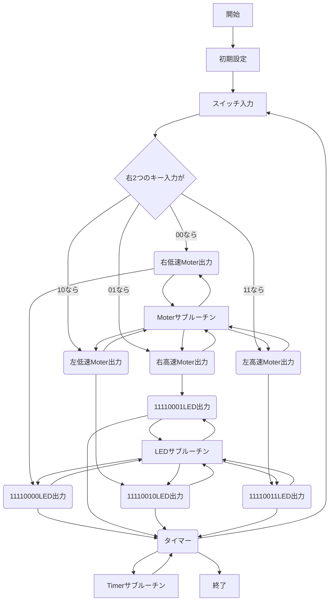

# 2018/12/03 マイコン3
<div style=text-align:center;><strong>3-C-19 TakahitoSueda</strong></div>

## issue
* [x] 課題4のコメント記入
## 目的
拡張パラレルIOボードの使い方を学び、拡張パラレルIOボードにステッピングモータをつなぎ制御する。
さらにスイッチも同時に制御することを目標とする。

## 装置
### 拡張パラレルIOボード
マイコントレーナには1つのIOポートがついています。
しかし、2つ以上の拡張ボードを接続する必要が生じることもあります。
MT-Zでは本演習で用いるパラレルIOボードを接続することで、2つのIOポートを増やすことができます。

## 実験
### 課題1
拡張パラレルIOボードに接続したステッピングモータを1相励磁回転で回転させなさい。
プログラムは前回のステッピングモータの制御プログラムの出力ポートアドレスを実験書を参考に修正することでステッピングモータは動きます。

プログラムを表1.1に示す。
<div style=text-align:center;>表1.1 課題1のプログラム</div>

| アドレス | 機械語   | ラベル | ニーモニック  | コメント                                            |
| -------- | -------- | ------ | ------------- | --------------------------------------------------- |
| 4        |          |        | PA EQU 04H    | オンボード ポートAアドレス                          |
| 5        |          |        | PB EQU 05H    | オンボード ポートBアドレス                          |
| 7        |          |        | CTL EQU 07H   | オンボード コントロールポートアドレス               |
| 90       |          |        | CLWD EQU 90H  | オンボード コントロールワード                       |
| 21       |          |        | PB2 EQU 21H   | 拡張IOボード ポートBアドレス                        |
| 23       |          |        | CTL2 EQU 23H  | 拡張IOボード コントロールポートアドレス             |
| 90       |          |        | CTLW EQU 90H  | 拡張IOボード コントロールワード                     |
|          |          |        |               |                                                     |
| 8400     |          |        | ORG 8400H     |                                                     |
| 8400     | 3E 90    |        | CL A, CLWD    | オンボード用コントロールワードをAレジスタに転送     |
| 8402     | D3 07    |        | OUT (CTL), A  | Aレジスタの値をオンボードコントロールポートに出力   |
| 8404     | 3E 90    |        | LD A, CTLW2   | 拡張IOボード用コントロールワードをAレジスタに転送   |
| 8406     | D3 23    |        | OUT (CTL2), A | Aレジスタの値を拡張IOボードコントロールポートに出力 |
| 8408     | 11 00 40 |        | LD DE, 4000H  | 4000HをDEレジスタに転送                             |
| 840B     | CD 1A 84 | LOOP:  | CALL MOTOR:   | モータを呼び出す                                    |
| 840E     | DB 04    |        | IN A, (PA)    | ポートAの状態をAレジスタに入力                      |
| 8410     | E6 01    |        | AND 01H       | 01Hと論理積をとる                                   |
| 8412     | FE 00    |        | CP 00H        | 00Hと比較する                                       |
| 8414     | CA 37 84 |        | JP Z, SLOW:   | フラグレジスタがZならばSLOWにジャンプ               |
| 8417     | C3 3D 84 |        | JP FAST       | そうでなければFASTにジャンプ                        |
|          |          |        |               |                                                     |
| 841A     | 3E 01    | MOTOR: | LD A, 01H     | 01HをAレジスタに転送                                |
| 841C     | D3 21    |        | OUT (PB2), A  | Aレジスタの値を拡張IOボード ポートBに出力           |
| 841E     | CD 00 86 |        | CALL TIMER    | タイマーを呼び出す                                  |
| 8421     | 3E 02    |        | LD A , 02H    | 02HをAレジスタに転送                                |
| 8423     | D3 21    |        | OUT (PB2), A  | Aレジスタの値を拡張IOボード ポートBに出力           |
| 8425     | CD 00 86 |        | CALL TIMER    | タイマーを呼び出す                                  |
| 8428     | 3E 04    |        | LD A, 04H     | 04HをAレジスタに転送                                |
| 842A     | D3 21    |        | OUT (PB2), A  | Aレジスタの値を拡張IOボード ポートBに出力           |
| 842C     | CD 00 86 |        | CALL TIMER    | タイマーを呼び出す                                  |
| 842F     | 3E 08    |        | LD A, 08H     | 08HをAレジスタに転送                                |
| 8431     | D3 21    |        | OUT (PB2), A  | Aレジスタの値を拡張IOボード ポートBに出力           |
| 8433     | CD 00 86 |        | CALL TIMER    | タイマーを呼び出す                                  |
| 8436     | C9       |        | RET           | ルーティン終了                                      |
|          |          |        |               |                                                     |
| 8437     | 11 00 10 | SLOW:  | LD DE, 1000H  | DEレジスタに1000Hを転送                             |
| 843A     | C3 0B 84 |        | JP LOOP       | LOOPにジャンプ                                      |
|          |          |        |               |                                                     |
| 843D     | 11 00 03 | FAST:  | LD DE, 300H   | DEレジスタに300Hを転送                              |
| 8440     | C3 0B 84 |        | JP LOOP       | LOOPにジャンプ                                      |
|          |          |        |               |                                                     |
| 8600     |          |        | ORG 8600H     |                                                     |
| 8600     | 62       | TIMER: | LD H, D       | Dレジスタの値をHレジスタに転送                      |
| 8601     | 6B       |        | LD L, E       | Eレジスタの値をLレジスタに転送                      |
| 8602     | 5F       |        | LD E, A       | Aレジスタの値をEれじすた に転送                     |
| 8603     | 2B       | TLOOP: | DEC HL        | HLレジスタの値から1を引く                           |
| 8604     | 7C       |        | LD A, H       | Hレジスタの値をAレジスタに転送                      |
| 8605     | B5       |        | OR L          | Aレジスタの値とLレジスタの値の論理和をとる          |
| 8606     | 20 FB    |        | JP NZ, TLOOP  | フラグレジスタがNZならばTLOOPにジャンプ             |
| 8608     | 7B       |        | LD A, E       | Eレジスタの値をAレジスタに転送                      |
| 8609     | C9       |        | RET           | ルーティンの終了                                    |
| 860A     |          |        | END           |                                                     |

### 課題2
課題1のプログラムに、LEDをすべて点灯させる機能を追加しましょう。

プログラムを表2.1に示す。
<div style=text-align:center;>表2.1 課題2のプログラム</div>

| アドレス | 機械語   | ラベル  | ニーモニック | コメント                                |
| -------- | -------- | ------- | ------------ | --------------------------------------- |
| 5        |          |         | PB EQU 05H   | ポートBのアドレス                       |
| 7        |          |         | CTL EQU 07H  | コントロールポートアドレス              |
| 21       |          |         | PB EQU 21H   | 拡張IOポートBアドレス                   |
| 23       |          |         | CTL EQU 23H  | 拡張IOコントロールポートアドレス        |
| 90       |          |         | CLWD EQU 90H | 拡張IOコントロールワード                |
|          |          |         |              |                                         |
| 8400     |          |         | ORG 8400H    |                                         |
| 8400     | 3E 90    | STPMTR: | LD A, CLWD   | コントロールワードをAレジスタに転送     |
| 8402     | D3 23    |         | OUT (CTL), A | Aレジスタの値をコントロールポートに出力 |
| 8404     | 3E 01    | LOOP:   | LD A, 01H    | 01HをAレジスタに転送                    |
| 8406     | D3 21    |         | OUT (PB), A  | Aレジスタの値をポートBに出力            |
| 8408     | CD 40 84 |         | CALL TIMER   | タイマーを呼び出す                      |
| 840B     | 3E 02    |         | LD A, 02H    | 02HをAレジスタに転送                    |
| 840D     | D3 21    |         | OUT(PB), A   | Aレジスタの値をポートBに出力            |
| 840F     | CD 40 84 |         | CALL TIMER   | タイマーを呼び出す                      |
| 8412     | 3E 04    |         | LD A, 04H    | 04HをAレジスタに転送                    |
| 8414     | D3 21    |         | OUT (PB), A  | Aレジスタの値をポートBに出力            |
| 8416     | CD 40 84 |         | CALL TIMER   | タイマーを呼び出す                      |
| 8419     | 3E 08    |         | LD A, 08H    | 08HをAレジスタに転送                    |
| 841B     | D3 21    |         | OUT (PB), A  | Aレジスタの値をポートBに出力            |
| 841D     | CD 40 84 |         | CALL TIMER   | タイマーを呼び出す                      |
| 8420     | 3E 90    |         | LD A, CLWD   | コントロールワードをAレジスタに転送     |
| 8422     | D3 07    |         | OUT 07 A     | Aレジスタの値をコントロールポートに出力 |
| 8424     | 3E FF    |         | LD A, FFH    | FFHをAレジスタに転送                    |
| 8426     | D3 05    |         | OUT (PB), A  | Aレジスタの値をコントロールポートに出力 |
| 8428     | C3 04 84 |         | JP LOOP      | ループにジャンプ                        |
|          |          |         |              |                                         |
| 8440     |          |         | ORG 8440H    |                                         |
| 8440     | 21 00 40 | TIMER:  | LD HL 4000H  | 値4000HをHLレジスタに転送               |
| 8443     | 5F       |         | LD E, A      | Aレジスタの値をEレジスタに転送          |
| 8444     | 2B       | TLOOP:  | DEC HL       | HLレジスタの値から1を引く               |
| 8445     | 7C       |         | LD A,H       | Hレジスタの値をAレジスタに転送          |
| 8446     | B5       |         | OR L         | Aの値とLの値の論理和をとる              |
| 8447     | 20 FB    |         | JR NZ, TLOOP | フラグレジスタがNZならばTLOOPにジャンプ |
| 8449     | 7B       |         | LD A, E      | Eレジスタの値をAレジスタに転送          |
| 844A     | C9       |         | RET          | ルーティン終了                          |
| 844B     |          |         | END          |                                         |

### 課題3
右側のスイッチがONの場合高速回転、OFFの場合は低速回転するプログラムを作りなさい。

プログラムを表3.1に示す。
<div sytle=text-align:center;>表3.1 課題3のプログラム</div>

| アドレス | 機械語   | ラベル | ニーモニック  | コメント                                            |
| -------- | -------- | ------ | ------------- | --------------------------------------------------- |
| 4        |          |        | PA EQU 04H    | オンボード ポートAアドレス                          |
| 5        |          |        | PB EQU 05H    | オンボード ポートBアドレス                          |
| 7        |          |        | CTL EQU 07H   | オンボード コントロールポートアドレス               |
| 90       |          |        | CLWD EQU 90H  | オンボード コントロールワード                       |
| 21       |          |        | PB2 EQU 21H   | 拡張IOボード ポートBアドレス                        |
| 23       |          |        | CTL2 EQU 23H  | 拡張IOボード コントロールポートアドレス             |
| 90       |          |        | CTLW EQU 90H  | 拡張IOボード コントロールワード                     |
|          |          |        |               |                                                     |
| 8400     |          |        | ORG 8400H     |                                                     |
| 8400     | 3E 90    |        | CL A, CLWD    | オンボード用コントロールワードをAレジスタに転送     |
| 8402     | D3 07    |        | OUT (CTL), A  | Aレジスタの値をオンボードコントロールポートに出力   |
| 8404     | 3E 90    |        | LD A, CTLW2   | 拡張IOボード用コントロールワードをAレジスタに転送   |
| 8406     | D3 23    |        | OUT (CTL2), A | Aレジスタの値を拡張IOボードコントロールポートに出力 |
| 8408     | 11 00 40 |        | LD DE, 4000H  | 4000HをDEレジスタに転送                             |
| 840B     | CD 1A 84 | LOOP:  | CALL MOTOR:   | モータを呼び出す                                    |
| 840E     | DB 04    |        | IN A, (PA)    | ポートAの状態をAレジスタに入力                      |
| 8410     | E6 01    |        | AND 01H       | 01Hと論理積をとる                                   |
| 8412     | FE 00    |        | CP 00H        | 00Hと比較する                                       |
| 8414     | CA 37 84 |        | JP Z, SLOW:   | フラグレジスタがZならばSLOWにジャンプ               |
| 8417     | C3 3D 84 |        | JP FAST       | そうでなければFASTにジャンプ                        |
|          |          |        |               |                                                     |
| 841A     | 3E 01    | MOTOR: | LD A, 01H     | 01HをAレジスタに転送                                |
| 841C     | D3 21    |        | OUT (PB2), A  | Aレジスタの値を拡張IOボード ポートBに出力           |
| 841E     | CD 00 86 |        | CALL TIMER    | タイマーを呼び出す                                  |
| 8421     | 3E 02    |        | LD A , 02H    | 02HをAレジスタに転送                                |
| 8423     | D3 21    |        | OUT (PB2), A  | Aレジスタの値を拡張IOボード ポートBに出力           |
| 8425     | CD 00 86 |        | CALL TIMER    | タイマーを呼び出す                                  |
| 8428     | 3E 04    |        | LD A, 04H     | 04HをAレジスタに転送                                |
| 842A     | D3 21    |        | OUT (PB2), A  | Aレジスタの値を拡張IOボード ポートBに出力           |
| 842C     | CD 00 86 |        | CALL TIMER    | タイマーを呼び出す                                  |
| 842F     | 3E 08    |        | LD A, 08H     | 08HをAレジスタに転送                                |
| 8431     | D3 21    |        | OUT (PB2), A  | Aレジスタの値を拡張IOボード ポートBに出力           |
| 8433     | CD 00 86 |        | CALL TIMER    | タイマーを呼び出す                                  |
| 8436     | C9       |        | RET           | ルーティン終了                                      |
|          |          |        |               |                                                     |
| 8437     | 11 00 10 | SLOW:  | LD DE, 1000H  | DEレジスタに1000Hを転送                             |
| 843A     | C3 0B 84 |        | JP LOOP       | LOOPにジャンプ                                      |
|          |          |        |               |                                                     |
| 843D     | 11 00 03 | FAST:  | LD DE, 300H   | DEレジスタに300Hを転送                              |
| 8440     | C3 0B 84 |        | JP LOOP       | LOOPにジャンプ                                      |
|          |          |        |               |                                                     |
| 8600     |          |        | ORG 8440H     |                                                     |
| 8600     | 21 00 40 | TIMER: | LD HL 4000H   | 値4000HをHLレジスタに転送                           |
| 8603     | 5F       |        | LD E, A       | Aレジスタの値をEレジスタに転送                      |
| 8604     | 2B       | TLOOP: | DEC HL        | HLレジスタの値から1を引く                           |
| 8605     | 7C       |        | LD A,H        | Hレジスタの値をAレジスタに転送                      |
| 8606     | B5       |        | OR L          | Aの値とLの値の論理和をとる                          |
| 8607     | 20 FB    |        | JR NZ, TLOOP  | フラグレジスタがNZならばTLOOPにジャンプ             |
| 8609     | 7B       |        | LD A, E       | Eレジスタの値をAレジスタに転送                      |
| 860A     | C9       |        | RET           | ルーティン終了                                      |
| 860B     |          |        | END           |                                                     |

### 課題4
右側のスイッチをONにすると時計まわりに回転し、OFFのとき反時計まわりに回転させるプログラムを作成しましょう。

プログラムを表4.1に示します。
<div sytle=text-align:center;>表4.1 課題4のプログラム</div>

| アドレス | 機械語      | ラベル    | ニーモニック       | コメント                    | 
|------|----------|--------|--------------|-------------------------| 
| 8400 | 3E 90    |        | LD A, 90     | 初期設定                    | 
| 8402 | D3 07    |        | OUT 07, A    | 初期設定                    | 
| 8404 | 3E 90    |        | LD A, 90     | 初期設定                    | 
| 8406 | D3 23    |        | OUT 23, A    | 初期設定                    | 
| 8408 | 11 00 40 |        | LD DE, 4000  | DEレジスタに4000Hを転送         | 
| 840B | DB 04    |        | IN A, O4     | 04ポートから入力               | 
| 840D | E6 01    |        | AND 01       | 01とAND                  | 
| 840F | FE 00    |        | CP 00        | 00と比較                   | 
| 8411 | CA 33 84 |        | JP Z, 8433   | ゼロフラグがZなら8433にジャンプ      | 
| 8414 | 3E 01    |        | LD A, 01     | Aに01Hをロード               | 
| 8416 | D3 21    |        | OUT 21, A    | Aレジスタをアウトプット            | 
| 8418 | CD 00 86 |        | CALL 8600    | TIMERを呼ぶ                | 
| 841B | 3E 02    |        | LD A, 02     | Aレジスタに02Hをロード           | 
| 841D | D3 21    |        | OUT 21, A    | Aレジスタをアウトプット            | 
| 841F | CD 00 86 |        | CALL 8600    | TIMERを呼ぶ                | 
| 8422 | 3E 04    |        | LD A, 04     | Aレジスタに04Hをロード           | 
| 8424 | D3 21    |        | OUT 21, A    | Aレジスタをアウトプット            | 
| 8426 | CD 00 86 |        | CALL 8600    | TIMERを呼ぶ                | 
| 8429 | 3E 08    |        | LD A, 08     | Aレジスタに08Hをロード           | 
| 842B | D3 21    |        | OUT 21, A    | Aレジスタをアウトプット            | 
| 842D | CD 00 86 |        | CALL 8600    | TIMERを呼ぶ                | 
| 8430 | C3 0B 84 |        | JP 840B      | 840Bにジャンプ               | 
| 8433 | 3E 08    |        | LD A, 08     | Aレジスタに08Hをロード           | 
| 8435 | D3 21    |        | OUT 21, A    | Aレジスタをアウトプット            | 
| 8437 | CD 00 86 |        | CALL 8600    | TIMERを呼ぶ                | 
| 843A | 3E 04    |        | LD A, 04     | Aレジスタに04Hをロード           | 
| 843C | D3 21    |        | OUT 21, A    | Aレジスタをアウトプット            | 
| 843E | CD 00 86 |        | CALL 8600    | TIMERを呼ぶ                | 
| 8441 | 3E 02    |        | LD A, 02     | Aレジスタに02Hをロード           | 
| 8443 | D3 21    |        | OUT 21, A    | Aレジスタをアウトプット            | 
| 8445 | CD 00 86 |        | CALL 8600    | TIMERを呼ぶ                | 
| 8448 | 3E 01    |        | LD A, 01     | Aレジスタに01Hをロード           | 
| 844A | D3 21    |        | OUT 21, A    | Aレジスタをアウトプット            | 
| 844C | CD 00 86 |        | CALL 8600    | TIMERを呼ぶ                | 
| 844F | C3 0B 84 |        | JP 840B      | 840Bにジャンプ               | 
|      |          |        |              |                         | 
| 8600 |          |        | ORG 8600H    |                         | 
| 8600 | 62       | TIMER: | LD H, D      | Dレジスタの値をHレジスタに転送        | 
| 8601 | 6B       |        | LD L, E      | Eレジスタの値をLレジスタに転送        | 
| 8602 | 5F       |        | LD E, A      | Aレジスタの値をEれじすた に転送       | 
| 8603 | 2B       | TLOOP: | DEC HL       | HLレジスタの値から1を引く          | 
| 8604 | 7C       |        | LD A, H      | Hレジスタの値をAレジスタに転送        | 
| 8605 | B5       |        | OR L         | Aレジスタの値とLレジスタの値の論理和をとる  | 
| 8606 | 20 FB    |        | JP NZ, TLOOP | フラグレジスタがNZならばTLOOPにジャンプ | 
| 8608 | 7B       |        | LD A, E      | Eレジスタの値をAレジスタに転送        | 
| 8609 | C9       |        | RET          | ルーティンの終了                | 
| 860A |          |        | END          |                         | 

### 課題5
一定時間をすぎるとステッピングモータの回転が止まるプログラムを作成せよ。

プログラムを表5.1に示す。
<div style=text-align:center;>表5.1 課題5のプログラム</div>

| アドレス | 機械語   | ラベル  | ニーモニック | コメント                                 |
| -------- | -------- | ------- | ------------ | ---------------------------------------- |
| 21       |          |         | PB EQU 21H   | 拡張IOポートBアドレス                    |
| 23       |          |         | CTL EQU 23H  | 拡張IOコントロールポートアドレス         |
| 90       |          |         | CLWD EQU 90H | 拡張IOコントロールワード                 |
|          |          |         |              |                                          |
| 8400     |          |         | ORG 8400H    |                                          |
|          |          |         |              |                                          |
| 83FE     | 06 FF    |         | LD B, FFH    | BレジスタにFFHを転送                     |
| 8400     | 3E 90    | STPMTR: | LD A, CLWD   | コントロールワードをAレジスタに転送      |
| 8402     | D3 23    |         | OUT (CTL), A | Aレジスタの値をコントロールポートに出力  |
| 8404     | 3E 01    | LOOP:   | LD A, 01H    | 01HをAレジスタに転送                     |
| 8406     | D3 21    |         | OUT (PB), A  | Aレジスタの値をポートBに出力             |
| 8408     | CD 40 84 |         | CALL TIMER   | タイマーを呼び出す                       |
| 840B     | 3E 02    |         | LD A, 02H    | 02HをAレジスタに転送                     |
| 840D     | D3 21    |         | OUT(PB), A   | Aレジスタの値をポートBに出力             |
| 840F     | CD 40 84 |         | CALL TIMER   | タイマーを呼び出す                       |
| 8412     | 3E 04    |         | LD A, 04H    | 04HをAレジスタに転送                     |
| 8414     | D3 21    |         | OUT (PB), A  | Aレジスタの値をポートBに出力             |
| 8416     | CD 40 84 |         | CALL TIMER   | タイマーを呼び出す                       |
| 8419     | 3E 08    |         | LD A, 08H    | 08HをAレジスタに転送                     |
| 841B     | D3 21    |         | OUT (PB), A  | Aレジスタの値をポートBに出力             |
| 841D     | CD 40 84 |         | CALL TIMER   | タイマーを呼び出す                       |
| 8420     | 5        |         | DEC B        | Bレジスタから1を引く                     |
| 8421     | FE 00    |         | CP 00H       | Bレジスタと00Hを比較する                 |
| 8423     | C2 04 84 |         | JP NZ, LOOP  | フラグレジスタがNZならばLOOPにジャンプ   |
| 8426     | C3 00 00 |         | JP 0000H     | そうでなければモニタプログラムにジャンプ |
|          |          |         |              |                                          |
| 8440     |          |         | ORG 8440H    |                                          |
| 8440     | 21 00 40 | TIMER:  | LD HL 4000H  | 値4000HをHLレジスタに転送                |
| 8443     | 5F       |         | LD E, A      | Aレジスタの値をEレジスタに転送           |
| 8444     | 2B       | TLOOP:  | DEC HL       | HLレジスタの値から1を引く                |
| 8445     | 7C       |         | LD A,H       | Hレジスタの値をAレジスタに転送           |
| 8446     | B5       |         | OR L         | Aの値とLの値の論理和をとる               |
| 8447     | 20 FB    |         | JR NZ, TLOOP | フラグレジスタがNZならばTLOOPにジャンプ  |
| 8449     | 7B       |         | LD A, E      | Eレジスタの値をAレジスタに転送           |
| 844A     | C9       |         | RET          | ルーティン終了                           |
| 844B     |          |         | END          |                                          |

### 課題6
時間とともにモータの回転が変化する(方向もしくは速度)プログラムを作成せよ。

プログラムを表6.1に示す。
<div style=text-align:center;>表6.1 課題6のプログラム</div>

| アドレス | 機械語   | ラベル  | ニーモニック | コメント                                |
| -------- | -------- | ------- | ------------ | --------------------------------------- |
| 21       |          |         | PB EQU 21H   | 拡張IOポートBアドレス                   |
| 23       |          |         | CTL EQU 23H  | 拡張IOコントロールポートアドレス        |
| 90       |          |         | CLWD EQU 90H | 拡張IOコントロールワード                |
|          |          |         |              |                                         |
| 8400     |          |         | ORG 8400H    |                                         |
| 8400     | 3E 90    | STPMTR: | LD A, CLWD   | コントロールワードをAレジスタに転送     |
| 8402     | D3 23    |         | OUT (CTL), A | Aレジスタの値をコントロールポートに出力 |
| 8404     | 3E 01    | LOOP:   | LD A, 01H    | 01HをAレジスタに転送                    |
| 8406     | D3 21    |         | OUT (PB), A  | Aレジスタの値をポートBに出力            |
| 8408     | CD 40 84 |         | CALL TIMER   | タイマーを呼び出す                      |
| 840B     | 3E 02    |         | LD A, 02H    | 02HをAレジスタに転送                    |
| 840D     | D3 21    |         | OUT(PB), A   | Aレジスタの値をポートBに出力            |
| 840F     | CD 40 84 |         | CALL TIMER   | タイマーを呼び出す                      |
| 8412     | 3E 04    |         | LD A, 04H    | 04HをAレジスタに転送                    |
| 8414     | D3 21    |         | OUT (PB), A  | Aレジスタの値をポートBに出力            |
| 8416     | CD 40 84 |         | CALL TIMER   | タイマーを呼び出す                      |
| 8419     | 3E 08    |         | LD A, 08H    | 08HをAレジスタに転送                    |
| 841B     | D3 21    |         | OUT (PB), A  | Aレジスタの値をポートBに出力            |
| 841D     | CD 40 84 |         | CALL TIMER   | タイマーを呼び出す                      |
| 8420     | 3E 08    |         | LD A, 08H    | 08HをAレジスタに転送                    |
|          | D3 21    |         | OUT (PB), A  | Aレジスタの値をポートBに出力            |
|          | CD 40 84 |         | CALL TIMER   | タイマーを呼び出す                      |
|          | 3E 04    |         | LD A, 04H    | 04HをAレジスタに転送                    |
|          | D3 21    |         | OUT(PB), A   | Aレジスタの値をポートBに出力            |
|          | CD 40 84 |         | CALL TIMER   | タイマーを呼び出す                      |
|          | 3E 02    |         | LD A, 02H    | 02HをAレジスタに転送                    |
|          | D3 21    |         | OUT (PB), A  | Aレジスタの値をポートBに出力            |
|          | CD 40 84 |         | CALL TIMER   | タイマーを呼び出す                      |
|          | 3E 01    |         | LD A, 01H    | 01HをAレジスタに転送                    |
|          | D3 21    |         | OUT (PB), A  | Aレジスタの値をポートBに出力            |
|          | CD 40 84 |         | CALL TIMER   | タイマーを呼び出す                      |
|          | C3 04 84 |         | JP LOOP      | ループにジャンプ                        |
|          |          |         |              |                                         |
| 8440     |          |         | ORG 8440H    |                                         |
| 8440     | 21 00 40 | TIMER:  | LD HL 4000H  | 値4000HをHLレジスタに転送               |
| 8443     | 5F       |         | LD E, A      | Aレジスタの値をEレジスタに転送          |
| 8444     | 2B       | TLOOP:  | DEC HL       | HLレジスタの値から1を引く               |
| 8445     | 7C       |         | LD A,H       | Hレジスタの値をAレジスタに転送          |
| 8446     | B5       |         | OR L         | Aの値とLの値の論理和をとる              |
| 8447     | 20 FB    |         | JR NZ, TLOOP | フラグレジスタがNZならばTLOOPにジャンプ |
| 8449     | 7B       |         | LD A, E      | Eレジスタの値をAレジスタに転送          |
| 844A     | C9       |         | RET          | ルーティン終了                          |
| 844B     |          |         | END          |                                         |


## 考察課題
### 考察課題1
メモリマップドIOとはどのような入出力方式か、説明せよ。

CPUがIOデバイスにアクセスするための命令を、RAMへのアクセスと同様の命令と同じアドレス空間で扱う方式。

### 考察課題2
メモリマップドIOではない方式で入出力を行うマイコンのIO空間はどのようになっているか、説明せよ。

メモリマップドIOとは違いCPUがIOデバイスにアクセスする命令が別途用意されている。
そのためアドレス空間もそれぞれ独立している。

### 考察課題3
次回の課題プログラムの流れを考えよ。

#### 次回の課題で満たさなければならない仕様
* [ ] ステッピングモータインターフェースをパラレルIOボードにつなぎ、1相励磁回転をさせる。
* [ ] 2つのスイッチを使って、回転方向と回転速度を独立して変えられるようにする。
* [ ] LEDの点灯を回転速度と回転方向の組み合わせごとに変化させる。
    * 変化のさせかたは任意。

#### 次回のレポートで報告する仕様
* [ ] 表示の仕様はどうなっているか
    * 回転方向と回転速度の各組み合わせに対して、どんな表示になるか
* [ ] どのスイッチがどの役割を果たしているのか
* [ ] フローチャートまたは別の手段を使って、大まかな処理の流れを報告
* [ ] ソースコードを報告

#### 考察
まず次回のプログラムは巨大になることが想定される。
その想定から予測できる人的ミスは以下の通りである。
* 入力ミス
* 入力ミスによる番地ミス
* 番地ミス修正中のさらなる人的ミス

以上を緩和する構成である必要がある。
よって、各処理をなるべくコンポーネント化し、コンポーネント間の疎結合を目指すことで人的ミスの修正範囲を狭めることを試みる。

#### 設計
まず今回の仕様から必要な機能を分析し、そこからコンポーネント化する。
各コンポーネントをサブルーチンとして実装する。
各ルーチン間のアドレスは可能な限り広く取ることでプログラムにミスがあった際の修正にスケーラビリティをもたせる。

##### ルーチン
* メインルーチン
  * 各サブルーチンを順に実行する。
  * 初期設定→入力判定→Moter出力→LED出力→Timer呼び出し→Loop
* Timerルーチン
  * タイマーを使用する。
  * delay文も考えたが、メインルーチンが長くなるので今回はTimerルーチンを用意する。
* Moterルーチン
  * 回転方向と回転速度を制御する。
  * サブルーチンの数が増えるが、入力判定の回数を減らしたいのでこの構成とする。
  * RHルーチン
    * 右高速を出力するサブルーチン
  * RLルーチン
    * 右低速を出力するサブルーチン
  * LHルーチン
    * 左高速を出力するサブルーチン
  * LLルーチン
    * 左低速を出力するサブルーチン
* LEDルーチン
  * 各状態を表示するLEDルーチン
  * 必要なパターンは右高速、右低速、左高速、左低速の4種類
  * 回転方向と回転速度を入力するスイッチの状態からLEDパターンを決定出力

##### フローチャート

```

