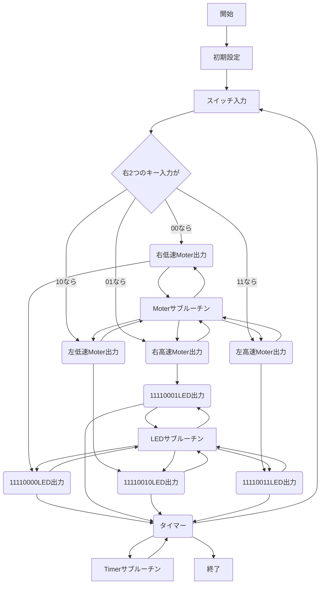

# 2018/12/10 マイコン4
<div style=text-align:center;><strong>3-C-19 TakahitoSueda</strong></div>

## 目的
マイクロコンピュータ演習の集大成として、これまで習った知識を用いてステッピングモータ制御システムを構築する。
## 装置
マイコントレーナMT-Z
ステッピングモータ
## 実験
### 最終課題
以下の機能を実装するプログラムを作りなさい。
細かい仕様は各グループの判断に任せる。
* ステッピングモータインターフェースをパラレルIOボードにつなぎ、1相励磁回転させる
* 2つのスイッチを使って、回転方向と回転速度を独立して変えられるようにする
* LEDの点灯を回転方向と回転速度の組み合わせごとに変化さえる
  * 変化のさせかたは任意
#### レポートで報告する点
* 表示の仕様の報告
* スイッチの仕様の報告
* フローチャートまたは別の手段を使って大まかな処理の流れを報告
* プログラムソースを報告
##### 表示の仕様
* 2個しか光らなかったら寂しいので左4つは常時点灯
* 右から2つはスイッチがONなら光る仕様
* 右から3つ目、4つ目は常時消灯
##### スイッチの仕様
* 右から1つ目がOFFなら低速回転する
  * ONなら高速回転する
* 右から2つ目がOFFなら右回転する
  * ONなら左回転する
##### フローチャート

```


##### プログラムソース
| アドレス | 機械語      | ラベル    | ニーモニック        | コメント                                | 
|------|----------|--------|---------------|-------------------------------------| 
| 4    |          |        | PA EQU 04H    |                                     | 
| 5    |          |        | PB EQU 05H    |                                     | 
| 7    |          |        | CTL EQU 07H   |                                     | 
| 90   |          |        | CLWD EQU 90H  |                                     | 
| 21   |          |        | PB2 EQU 21H   |                                     | 
| 23   |          |        | CTL2 EQU 23H  |                                     | 
| 90   |          |        | CTLW EQU 90H  |                                     | 
| 8400 |          | START: | ORG 8400H     | 開始                                  | 
| 8400 | 3E 90    | INIT:  | LD A, CLWD    | 初期設定                                | 
| 8402 | D3 07    |        | OUT (CTL), A  |                                     | 
| 8404 | 3E 90    |        | LD A, CLWD    |                                     | 
| 8406 | D3 23    |        | OUT (CTL2), A |                                     | 
| 8408 | DB 04    | LOOP:  | IN A, (PA)    | ポートAの値をAレジスタに入力                     | 
| 840A | 47       |        | LD B, A       | Aレジスタの値をBレジスタに転送する                  | 
| 840B | F6 F0    | LED:   | OR F0H        | LED出力 点灯が少ないと寂しいのでF0Hを足して左4つ常時点灯とする | 
| 840D | D3 05    |        | OUT (PB), A   | Aレジスタの値をLEDに出力                      | 
| 840F | 78       |        | LD A, B       |                                     | 
| 8410 | E6 01    | IF_S:  | AND 01H       | 回転速度判定                              | 
| 8412 | FE 01    |        | CP 01H        |                                     | 
| 8414 | CA 40 84 |        | JP Z, LOW:    |                                     | 
| 8417 | C3 30 84 |        | JP HIGH:      |                                     | 
| 841A | 78       | IF_D:  | LD A, B       | 回転方向判定 / Bレジスタの値をAレジスタに転送する         | 
| 841B | E6 02    |        | AND 02H       |                                     | 
| 841D | FE 02    |        | CP 02H        |                                     | 
| 841F | CA 50 84 |        | JP Z, LEFT:   |                                     | 
| 8422 | C3 70 84 |        | JP RIGHT:     |                                     | 
| 8425 | C3 00 00 |        | END           | 終了                                  | 

| アドレス | 機械語      | ラベル    | ニーモニック        | コメント                      | 
|------|----------|--------|---------------|---------------------------| 
| 8430 | 11 00 10 | HIGH:  | LD DE 1000H   | 高回転サブルーチン/DEレジスタに1000Hを転送 | 
| 8433 | C3 1A 84 |        | JP IF_D:      | メインルーチンに戻る                | 
|      |          |        |               |                           | 
| 8440 | 11 00 01 | LOW:   | LD DE 100H    | 低回転サブルーチン/DEレジスタに100Hを転送  | 
| 8443 | C3 1A 84 |        | JP IF_D:      | メインルーチンに戻る                | 
|      |          |        |               |                           | 
| 8450 | 3E 08    | LEFT:  | LD A, 08H     | 左回転のサブルーチン                | 
| 8452 | D3 21    |        | OUT (PB), A   |                           | 
| 8454 | CD 90 84 |        | CALL TIMER:   |                           | 
| 8457 | 3E 04    |        | LD A, 04H     |                           | 
| 8459 | D3 21    |        | OUT (PB), A   |                           | 
| 845B | CD 90 84 |        | CALL TIMER:   |                           | 
| 845E | 3E 02    |        | LD A, 02H     |                           | 
| 8460 | D3 21    |        | OUT (PB), A   |                           | 
| 8462 | CD 90 84 |        | CALL TIMER:   |                           | 
| 8465 | 3E 01    |        | LD A, 01H     |                           | 
| 8467 | D3 21    |        | OUT (PB), A   |                           | 
| 8469 | CD 90 84 |        | CALL TIMER:   |                           | 
| 846C | C3 08 84 |        | JP LOOP:      | メインルーチンに戻る                | 
|      |          |        |               |                           | 
| 8470 | 3E 01    | RIGHT: | LD A, 01H     | 右回転のサブルーチン                | 
| 8472 | D3 21    |        | OUT (PB), A   |                           | 
| 8474 | CD 90 84 |        | CALL TIMER:   |                           | 
| 8477 | 3E 02    |        | LD A, 02H     |                           | 
| 8479 | D3 21    |        | OUT (PB), A   |                           | 
| 847B | CD 90 84 |        | CALL TIMER:   |                           | 
| 847E | 3E 04    |        | LD A, 04H     |                           | 
| 8480 | D3 21    |        | OUT (PB), A   |                           | 
| 8482 | CD 90 84 |        | CALL TIMER:   |                           | 
| 8485 | 3E 08    |        | LD A, 08H     |                           | 
| 8487 | D3 21    |        | OUT (PB), A   |                           | 
| 8489 | CD 90 84 |        | CALL TIMER:   |                           | 
| 848C | C3 08 84 |        | JP LOOP:      | メインルーチンに戻る                | 
|      |          |        |               |                           | 
| 8490 | 62       | TIMER: | LD H, D       | タイマーサブルーチン                | 
| 8491 | 6B       |        | LD L, E       |                           | 
| 8492 | 5F       |        | LD E, A       |                           | 
| 8493 | 2B       | TLOOP: | DEC HL        |                           | 
| 8494 | 7C       |        | LD A, H       |                           | 
| 8495 | B5       |        | OR L          |                           | 
| 8496 | 20 FB    |        | JP NZ, TLOOP: |                           | 
| 8498 | 7B       |        | LD A, E       |                           | 
| 8499 | C9       |        | RET           | メインルーチンに戻る                | 
