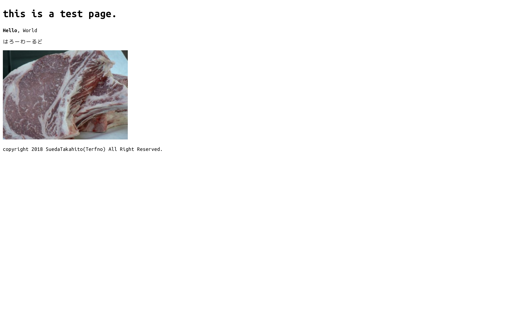
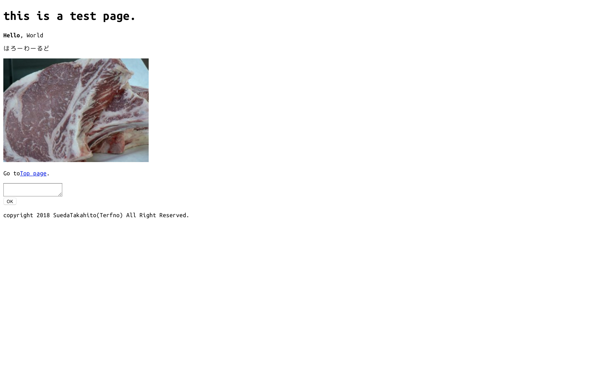
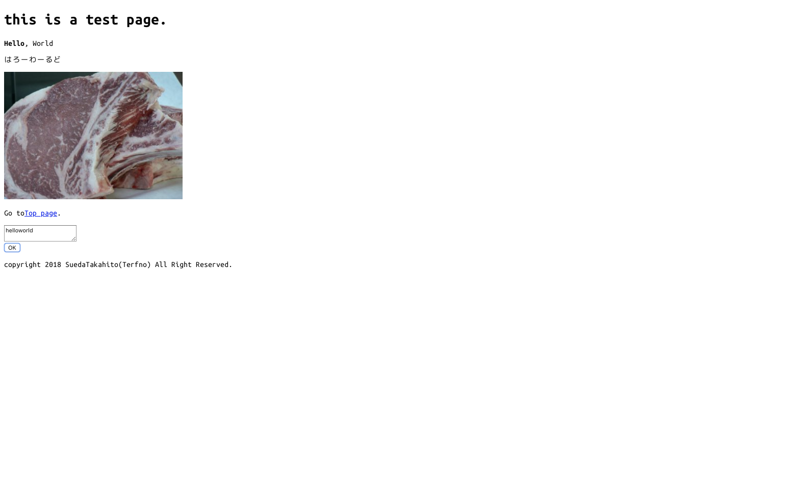
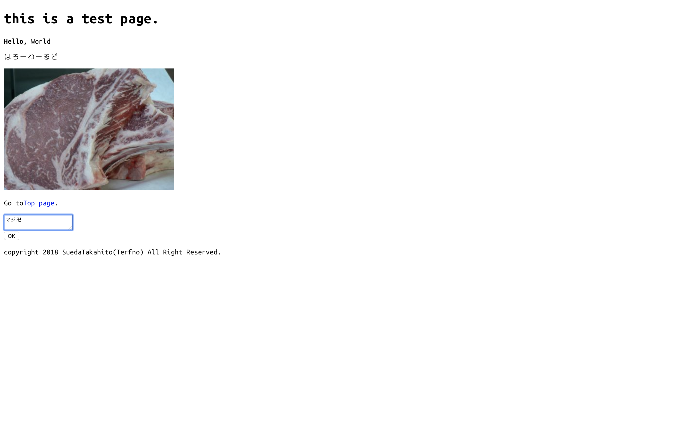
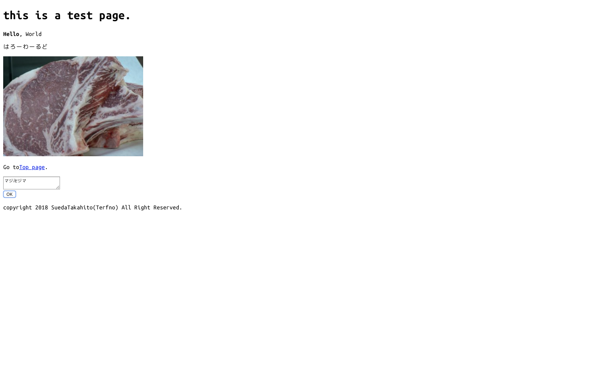

# 2018/10/30　ネットワーク演習１
## issue
* [x] ソースコードは表として表記する
* [x] スクリーンショットの修正
* [x] キャプションの修正
* [x] 表キャプションは上
## 目的
2018年現在、インターネットはずいぶん身近なものになった。私達は,手持ちのスマートフォンを数回タップしてChromeやSafari、FirefoxなどのWebブラウザ(以下ブラウザ)を立ち上げるだけで、容易に、インターネットに接続された世界中のwebサーバにアクセスすることができる。これらのWebサーバは、ブラウザからのアクセスに伴い身近なニュースや天気、音楽・映画コンテンツなど、さまざまなものをブラウザに送信することによって、私達に情報を提供している。本演習では、一般的によく知られたWebサーバであるApache Http Serverを使ってWebサーバの基本を学ぶ。
## レポート課題1.1
URLにおけるhttp以外のスキームを3つ以上調査し、用途と共にそれらを報告しなさい。

### https
Hypertext Transfer Protocol Secureの略
http通信をよりセキュアに行うためのプロトコル
### ftp
File Transfer Protocolの略
ネットワークでファイルのやり取りをするためのプロトコル
### file
ローカルファイルにアクセスするスキーム
## 問題1.1
Apache2の初期ページを読み込み、表示されたページから`Configuration Overview`の項に表示されている、設定ファイルが設置されたディレクトリパスを報告しなさい。
また、`Document Roots`の項に表示されている、`default Debian document root`のディレクトリパスも報告しなさい
### configuration overview
設定ファイルが配置されたディレクトリパスを表1.1.1に示す。
<div style="text-align:center;">表1.1.1 configuration overview</div>

```
/etc/apache2/
|-- apache2.conf
|       `--  ports.conf
|-- mods-enabled
|       |-- *.load
|       `-- *.conf
|-- conf-enabled
|       `-- *.conf
|-- sites-enabled
|       `-- *.conf
```

### default Debian document root

default debian document rootのディレクトリパスを表1.1.2に示す。
<div style="text-align:center;">表1.1.2 default debian document root</div>
```
/var/www/html
```

## 問題1.2
図1.8のサンプルコードを報告しなさい。
ブラウザでアクセスしたときのURLと、実行結果のスクリーンショットを報告しなさい。

### サンプルコード index.html
サンプルコードを表1.2.1に示す。
<div style="text-align:center;">表1.2.1 サンプルコード</div>

```html
<!DOCTYPE html>
<html>
	<head>
		<meta charset="utf-8">
		<title>Hello World</title>
	</head>
	<body>
		<h1>this is a test page.</h1>
		<p><strong>Hello</strong>, World</p>
		<p>はろーわーるど</p>
		
		<p>copyright 2018 SuedaTakahito(Terfno) All Right Reserved.</p>
	</body>
</html>

```

### URL
URLを表1.2.2に示す。
<div style="text-align:center;">表1.2.2 url</div>

```
http://172.20.144:39/index.html
```

### スクリーンショット
実行結果のスクリーンショットを図1.2.3に示す


<div style="text-align:center;">図1.2.3 サンプルコードを実行した際のスクリーンショット</div>

## 問題1.3
テキストの図1.12および図1.13を図1.8の適切な箇所に挿入したソースコードを報告しなさい。
なお、textarea要素とinput要素の見え方は図1.14になるように図1.13を改変すること。
またブラウザでアクセスした際のスクリーンショットを報告しなさい。
### 適切な箇所に挿入したソースコード
適切な箇所に挿入したソースコードを表1.3.1に示す。
<div style="text-align:center;">表1.3.1 ソースコード</div>

```html
<!DOCTYPE html>
<html>
	<head>
		<meta charset="utf-8">
		<title>Hello World</title>
	</head>
	<body>
		<h1>this is a test page.</h1>
		<p><strong>Hello</strong>, World</p>
		<p>はろーわーるど</p>
		
		<p>Go to<a href="/index.html">Top page</a>.</p>
		<textarea></textarea>
		<div>
			<input type="button" value="OK">
		</div>
		<p>copyright 2018 SuedaTakahito(Terfno) All Right Reserved.</p>
	</body>
</html>

```

### スクリーンショット
実行結果のスクリーンショットを図1.3.2に示す。


<div style="text-align:center;">図1.3.2 適切な箇所に挿入したソースコードを実行した際のスクリーンショット</div>

## レポート課題1.2
問題1.3にて作成したHTML文章で使われているインライン要素とブロック要素をそれぞれ分類して列挙しなさい。

### インライン要素
``はインライン要素である。
`<textarea></textarea>`はインライン要素である。
`<p><strong>Hello</strong>, World</p>`の行にある`<strong>Hello</strong>`はインライン要素である。
また`<p>Go to<a href="/index.html">Top page</a>.</p>`の行にある`<a href="/index.html">Top page</a>`もまたインライン要素である。

### ブロック要素
`<h1>this is a test page.</h1>`はブロック要素である。
`<p><strong>Hello</strong>, World</p>`はブロック要素である
`<p>はろーわーるど</p>`はブロック要素である。
`<p>Go to<a href="/index.html">Top page</a>.</p>`はブロック要素である。
`<div><input type="button" value="OK"></div>`はブロック要素である。
`<p>copyright 2018 SuedaTakahito(Terfno) All Right Reserved.</p>`はブロック要素である。

## 問題1.4
図1.8に図1.16と図1.17の変更を追加し、ソースコードを報告しなさい。
また、ブラウザでの実行結果をスクリーンショットで報告しなさい。

### ソースコード
ソースコードを表1.4に報告する。
<div style="text-align:center;">図1.4 ソースコード</div>

```html
<!DOCTYPE html>
<html>
	<head>
		<meta charset="utf-8">
		<title>Hello World</title>
	</head>
	<body>
		<h1>this is a test page.</h1>
		<p><strong>Hello</strong>, World</p>
		<p>はろーわーるど</p>
		
		<p>Go to<a href="/index.html">Top page</a>.</p>
		<textarea id="sample-text"></textarea>
		<div>
			<input id="sample-exec-button" type="button" value="OK">
		</div>
		<p>copyright 2018 SuedaTakahito(Terfno) All Right Reserved.</p>
		<script>
			function removeSpaces(){
				let textArea = document.querySelector("#sample-text")
				let text = textArea.value
				let nextText = ""

				for(let i = 0; i < text.length; i = i + 1){
					let c = text[i]

					if(c != " "){
						nextText = nextText + c
					}
				}
				textArea.value = nextText
		}
		let button = document.querySelector("#sample-exec-button")
		button.addEventListener("click", removeSpaces)
		</script>
	</body>
</html>

```

### スクリーンショット
ブラウザでの実行結果のうちテキストを入力する前の状態を図1.4.1に、テキストを入力した後の状態を図1.4.2に、そして`OK`ボタンを押した後の状態を図1.4.3に示す。

----

<div style="text-align:center;">図1.4.1 テキストを入力する前の状態</div>

----

<div style="text-align:center;">図1.4.2 テキストを入力した後の状態</div>

----

<div style="text-align:center;">図1.4.3 OKボタンを押した後の状態</div>

----

## 問題1.5
textarea要素に入力されたテキストをinput要素のボタンのクリックに連動させて、回文に変更するプログラムを作成し、ソースコードを報告しなさい。
また、ブラウザでの実行結果をスクリーンショットで報告しなさい。
ここで言う回文とは、はじめから読んだ場合と終わりから読んだ場合で文字の順番が変わらない文字列のことである。
たとえば原文が`しぶい`ならば、回文は`しぶいぶし`である。
### ソースコード
ソースコードを表1.5に示す。
<div style="text-align:center;">表1.5 ソースコード</div>

```html
<!DOCTYPE html>
<html>
	<head>
		<meta charset="utf-8">
		<title>Hello World</title>
	</head>
	<body>
		<h1>this is a test page.</h1>
		<p><strong>Hello</strong>, World</p>
		<p>はろーわーるど</p>
		
		<p>Go to<a href="/index.html">Top page</a>.</p>
		<textarea id="sample-text"></textarea>
		<div>
			<input id="sample-exec-button" type="button" value="OK">
		</div>
		<p>copyright 2018 SuedaTakahito(Terfno) All Right Reserved.</p>
		<script>
			function kaibun(){
                let textArea = document.querySelector("#sample-text")
                let genbun = textArea.value
                let copy = textArea.value
                for(let i=copy.length-2;0<=i;i--){
                    genbun += copy[i]
                }
					textArea.value = genbun
            }
            let button = document.querySelector("#sample-exec-button")
            button.addEventListener("click", kaibun)
		</script>
	</body>
</html>

```

### スクリーンショット
ブラウザでの実行結果のうちテキストを入力する前の状態を図1.5.1に、テキストを入力した後の状態を図1.5.2に、そして`OK`ボタンを押した後の状態を図1.5.3に示す。

----

<div style="text-align:center;">図1.5.1 テキストを入力する前の状態</div>

----

<div style="text-align:center;">図1.5.2 テキストを入力した後の状態</div>

----

<div style="text-align:center;">図1.5.3 OKボタンを押した後の状態</div>

----
