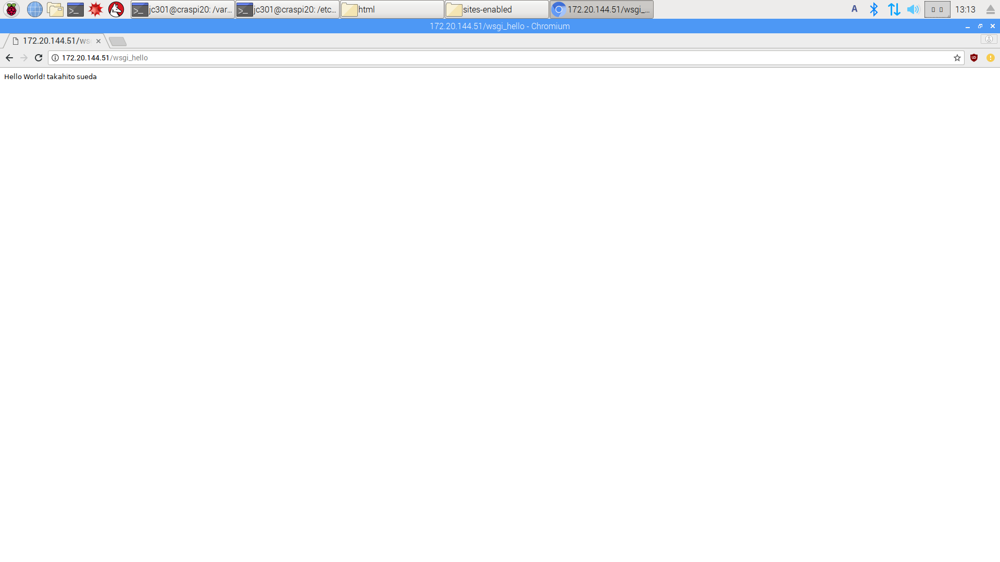
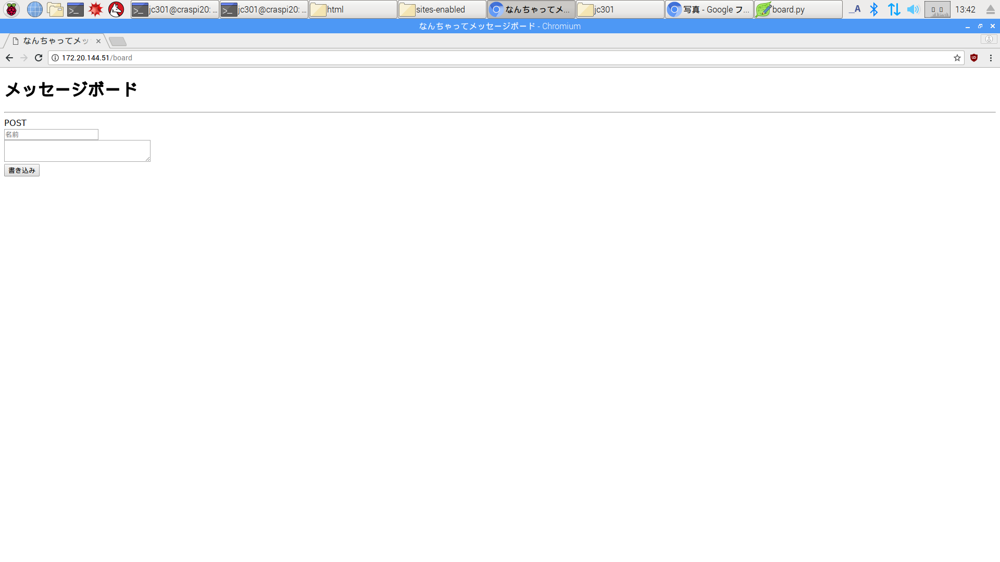
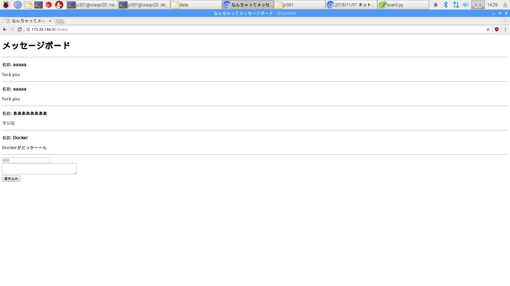

# 2018/11/01 ネットワーク演習2
## issue
* [x] ソースコードは表として表記する
* [x] キャプション
* [x] 表キャプションは上
## 目的
本演習では、インターネットを構築する技術のうち、基礎的なwebサーバに関わる技術を2回に分けて学ぶ。1週目では、Webサーバの理解とWebアプリケーションのうちクライアント再度プログラムを学んだ。2週目ではWebアプリケーションのうちサーバ^サイドプログラムの基礎を学ぶ。

サーバサイドプログラムはPHP、Perl、Java、C#やRubyなどさまざまな言語で作成することができるが、本演習ではPython を使ったサーバサイドプログラムを作成する。
なお本演習ではPython3系の利用を仮定して話を進める。
## 問題2.1
図2.1のプログラムを`Hello World <自分の名前>`が返されるように改変し、アクセスした際のブラウザのスクリーンショットを報告しなさい。
### ソースコード
ソースコードを表2.1.1に示す。
<div style="text-align:center;">表2.1.1 ソースコード</div>

```py
def application(environ, start_response):
	output='Hello World! takahito sueda'.encode('utf-8')
	start_response('200 ok', [('Content-Type', 'text/plane; charset=UTF-8')])
	return [output]

```

### スクリーンショット
アクセスした際のスクリーンショットを図2.1に示す。



<div style="text-align:center;">図2.1 アクセスした際のスクリーンショット</div>

## 問題2.2
図2.8で示すプログラムを作成し、ソースコードを報告しなさい。
また、スクリーンショットも報告しなさい。

### ソースコード
作成したソースコードを表2.2.1に示す。
<div style="text-align:center;">表2.2.1 ソースコード</div>

```py
BODY_TEMPLATE="""
<!DOCTYPE html>
<html>
	<head>
		<meta charset="utf-8">
		<title>なんちゃってメッセージボード</title>
	</head>
	<body>
		<h1>メッセージボード</h1>
		<hr>

		{0}

		<form action="/board" method="post">
			<div>
				<input type="text" name="name" value="" placeholder="名前">
			</div>
			<div>
				<textarea name="comment" placeholder="メッセージを書いてください">
				</textarea>
			</div>
			<div>
				<input type="submit" value="書き込み">
			</div>
		</form>
	</body>
</html>
"""

def application(environ, start_response):
	request_method=environ['REQUEST_METHOD']
	raw_response=BODY_TEMPLATE.format(request_method)
	response=raw_response.encode('utf-8')
	start_response('200 ok' , [('Content-Type', 'text/html; charset=UTF-8')])

	return [response]

```

### スクリーンショット
アクセスした際のスクリーンショットを図2.2に示す。



<div style="text-align:center;">図2.2 アクセスした際のスクリーンショット</div>

## レポート課題2.1
HTTPリクエストメソッドについて他に存在するものについて調査し、どのような役割化説明しなさい

### Delete メソッド
指定したリソースを削除するリクエスト

### patch メソッド
リソースを部分的に変更するリクエスト

## レポート課題2.2
レスポンス状態コードを3つ調べてどのような番号でどのようなときに返されるのか方向しなさい。

### 404 not found
指定したリソースが見つからないことを表すレスポンス状態コード。

### 503 Service Unavailable
サーバがリクエストを処理することができていない状態を表すレスポンス状態コード。

### 504 Gateway Timeout
ゲートウェイとして動作するサーバが時間内にレスポンスを返さない状態を表すレスポンス状態コード。

## レポート課題2.3
演習で作成しているプログラムにPOSTとGET以外のメソッドでリクエストした場合、HTTPレスポンス状態コードを返すべきか説明しなさい。

### 500 Internal Server Error
サーバでリクエスト処理方法がわからない場合に返されるレスポンス状態コードなので、唐突に知らないメソッドでリクエストされると処理方法が分からず500を返すことになる。

## 問題2.3
図2.8に図2.13を追加してプログラムを作成しソースコードを方向しなさい。
またスクリーンショットも報告しなさい。

### ソースコード
作成したソースコードを表2.3.1に示す。
<div style="text-align:center;">表2.3.1 ソースコード</div>

```py
BODY_TEMPLATE="""
<!DOCTYPE html>
<html>
	<head>
		<meta charset="utf-8">
		<title>なんちゃってメッセージボード</title>
	</head>
	<body>
		<h1>メッセージボード</h1>
		<hr>

		{0}

		<form action="/board" method="post">
			<div>
				<input type="text" name="name" value="" placeholder="名前">
			</div>
			<div>
				<textarea name="comment" placeholder="メッセージを書いてください">
				</textarea>
			</div>
			<div>
				<input type="submit" value="書き込み">
			</div>
		</form>
	</body>
</html>
"""

from urllib.parse import parse_qs
import os.path
import json

MESSAGE_PATH = '/var/www/html/data/messages.json'

def write_messages(messages):
    fp=open(MESSAGE_PATH, 'w')
    json.dump(messages,fp)

    fp.close()

def read_messages():
	fp = open(MESSAGE_PATH, 'r')
	messages = json.load(fp)

	fp.close()
	return messages

def parse_get_request():
	if os.path.exists(MESSAGE_PATH) is False:
		messages = []
		write_messages(messages)
	else:
		messages = read_messages()

	return messages

def parse_post_request(environ):
	body_p=environ['wsgi.input'].read()
	q=parse_qs(body_p.decode())

	messages = read_messages()

	if len(q) != 0:
		name = q['name'][0]
		text = q['comment'][0]

		messages.append({'name':name,'text':text})

		write_messages(messages)

	return messages

def create_response_body(messages):
	insert_text = ''
	LINE_FORMAT = '<p>名前: <strong>{0}</strong></p>\n<p>{1}</p><hr>'

	for m in messages:
		insert_text = insert_text + LINE_FORMAT.format(m['name'],m['text'])

	return insert_text

def application(environ, start_response):
	request_method = environ['REQUEST_METHOD']

	if request_method == 'GET':
		messages = parse_get_request()

	elif request_method == 'POST':
		messages = parse_post_request(environ)

	insert_text = create_response_body(messages)

	raw_response = BODY_TEMPLATE.format(insert_text)
	response = raw_response.encode('utf-8')

	start_response('200 ok', [('Content-Type','text/html; charset=UTF-8')])

	return [response]

```

### スクリーンショット
アクセスした際のスクリーンショットを図2.3に示す。


## レポート課題2.4
JSON以外にWebアプリケーションなどで使われるデータフォーマットを3種類調査してまとめよう

### YAML
`YAML Ain't a Markup Language`の略
雰囲気マークアップっぽく書ける。
構文の例を表2.4.1に示す。
<div style="text-align:center;">表2.4.1 YAMLの例</div>
```yaml
# "---" でセパレートすることで一つのファイルに複数記述できる。
--- # ブロック
name: John Smith
age: 33
--- # インライン
{name: John Smith, age: 33}
```

### TOML
`Tom's Obvious, Minimal Language`の略
構文の例を表2.4.2に示す。
<div style="text-align:center;">表2.4.2 TOMLの例</div>

```yaml
# コメント
[section names]
key = "value"
```
String、Integer、Float、Boolean、Datetime、Array、Table等の型をサポートする。

### CSON
`CoffeeScript-Object-Notation`の略
パット見Jsonっぽい雰囲気がある。
jsはcoffeeでいい感じにパースできる。
構文の例を表2.4.3に示す。
<div style="text-align:center;">表2.4.3 CSONの例</div>

```yaml
{
    # an array
    abc: [
        'a'
        'b'
        'c'
    ]

    # an object
    a:
        b: 'c'
}
```

## レポート課題2.5
今回作成したプログラムでは、受信したフォーム入力値をファイルとして保存している。
しかし、一般的なWebアプリケーションではデータベースを使うことが多い。
データベースをWebアプリケーションで使う利点を答えなさい。

クエリによる強力なサーチ機能を使用することで膨大なデータから必要なデータを探し出すことができるようになるという利点がある。
ファイルに保存する場合とは違い、複数ユーザによる使用を可能とする機能を備えているためより快適なUXを設計できる利点がある。
