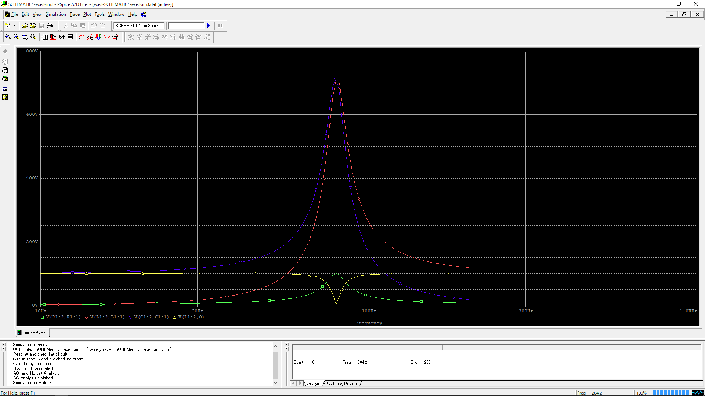
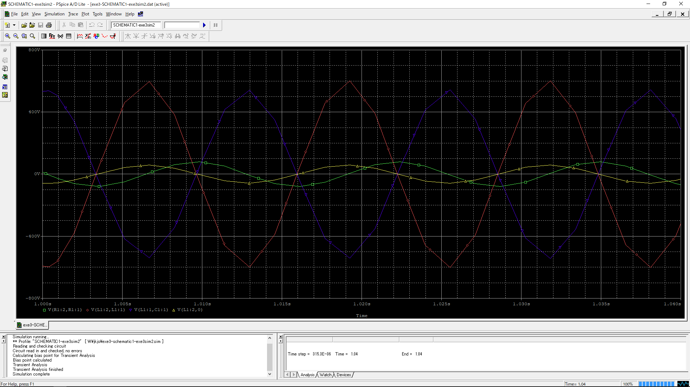
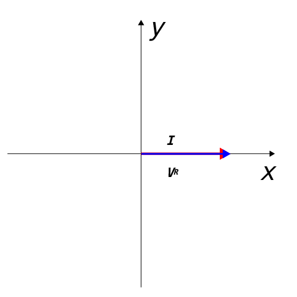
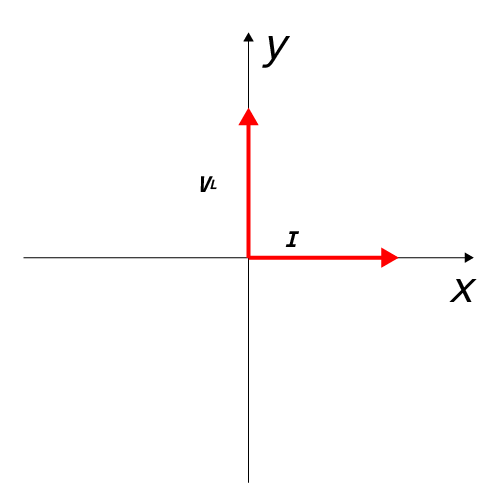

# 2018/11/12 回路シミュレーション(2)
## issue
* [x] 表キャプション位置修正
## 目的
2年、3年で学習した電気回路や電子回路およびその応用回路についてパソコンによるシミュレーションを行い、その回路の動作をより深く理解することを目的とする。
具体的には回路解析シミュレーション・ソフトウェアの使い方をマスターするとともに、電気回路のシミュレーションの結果を解析し、考察するとこにある。

## 使用するソフトウェア
OrCAD Capture CIS Lite Editionを用いる。

## 演習3 (1)
実験書の図10に示す R,L,Cを直列に接続した回路の周波数特性(周波数可変範囲$10$[Hz]から$200$[Hz]までとする)をシミュレーションする。
これにより、横軸を周波数、縦軸を抵抗R、インダクタンスLとコンデンサーCの、それぞれの両端の電圧のグラフを表示する。
また、別に電流も表示させること。
このグラフより、共振周波数(もっとも電流が大きくなる周波数)の概略値と、共振時の電流と各電圧($V_R,V_L,V_C,V_{LC}$)の大きさを求めよ。

### グラフ
VLCのグラフをグラフ3.1.1に示す。

グラフ3.1.1 VLCのグラフ

----
別に出力した電流のグラフをグラフ3.1.2に示す。

グラフ3.1.2 電流のグラフ

### 共振周波数の概略値
印刷されたグラフ3.2のメモリをものさしで計測した結果、$10$[Hz]から$100$[Hz]までが11.95[cm]であった。
同様にして電流が最大の際の$0$[A]から頂点の$100$[Hz]までが1.2[cm]だった。
$1:x=11.95:1.2$
$11.95x=1.2$
$x=\frac{1.2}{11.95}=0.1004$
$10^{2-x}=10^{2-0.1004}=10^{1.8996}=79.359…=79.34$
$\therefore$ 共振周波数の概略値は$79.34$[Hz]

### 共振時の電流と各電圧の大きさ
印刷されたグラフ3.1のメモリをものさしで計測した結果、$V_L$は$12.3$[cm]、$V_C$は$12.3$[cm]、$V_R$は$1.7$[cm]、$V_{LC}$は$0.025$[cm]であった。
また、同様にして計測した結果、$0$[V]から$800$[V]までが$13.81$[cm]であった。

$V_L$の場合
$800:13.81=x:12.3$
$13.81x=800\times12.3$
$x=\frac{800\times12.3}{13.81}=712.53$
$\therefore$ 712.53[V]

$V_C$の場合
$800:13.81=x:12.3$
$13.81x=800\times12.3$
$x=\frac{800\times12.3}{13.81}=712.53$
$\therefore$ 712.53[V]

$V_R$の場合
$800:13.81=x:1.7$
$13.81x=800\times1.7$
$x=\frac{800\times1.7}{13.81}=98.48$
$\therefore$ 98.48[V]

$V_{LC}$の場合
$800:13.81=x:0.025$
$13.81x=800\times0.025$
$x=\frac{800\times0.025}{13.81}=1.45$
$\therefore$ 1.45[V]

## 演習3 (2)
実験書の図10に示すR,L,Cを直列に接続した回路について、演習1や2と同様に、各素子の電圧、電流の波形を表示させて位相を求め、これを元にベクトル図を示せ。
なお、電源の周波数は、この回路の共振周波数(理論値)に設定する。

### グラフ
シミュレーション結果をグラフ3.2.1に示す。

グラフ3.2.1 VLCのグラフ

----

また別途出力した電流のグラフをグラフ3.2.2に示す。

グラフ3.2.2 電流のグラフ

### 各素子の電圧電流の位相
#### R
電流との位相差は無かった

#### L
$V_L$との間に位相差があり、その大きさは、
$\frac{1.8}{7.5}\times 360^\circ=86.4^\circ$
であった。
$\therefore$電流に対して、電圧が$86.4^\circ$進んでいた。

#### C
$V_C$との間に位相差があり、その大きさは、
$\frac{1.8}{7.5}\times 360^\circ=86.4^\circ$
であった。
$\therefore$電流に対して、電圧が$86.4^\circ$遅れていた。

### ベクトル図
電流と$V_R$のベクトル図を図3.2.3に示す。

図3.2.3 電流と$V_R$の位相

----
電流と$V_L$のベクトル図を図3.2.4に示す。

図3.2.4 電流と$V_L$の位相

----
電流と$V_C$のベクトル図を図3.2.4に示す。


図3.2.3 電流と$V_R$の位相

## 演習3のまとめ
実験書の表2を表3.3に示す。

表3.3 演習3のまとめ

| 理論値      | シミュレーション値              |                        | 
|----------|------------------------|------------------------| 
| $I$      | $0.28\angle 0^\circ$   | $0.530\angle 0^\circ$  | 
| $V_R$    | $100\angle 0^\circ$    | $92\angle 0^\circ$     | 
| $V_C$    | $71\angle10 ^\circ$    | $544\angle86.4^\circ$  | 
| $V_L$    | $70\angle7 ^\circ$     | $591\angle86.4 ^\circ$ | 
| $V_{LC}$ | $95.8\angle -73^\circ$ | $57\angle 0^\circ$     | 