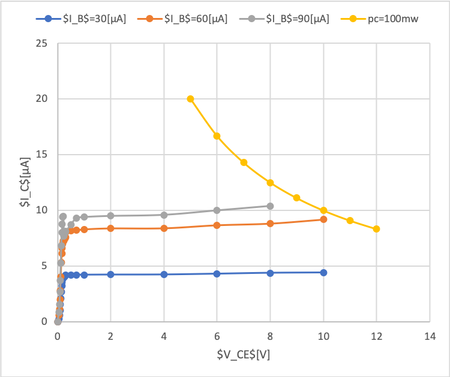

# ダイオード・トランジスタの特性

## 目的

ダイオードおよびトランジスタの基本的な性質について理解する。

## 実験内容

ダイオードの順方向特性と逆方向特性、トランジスタの増幅作用・スイッチング作用、トランジスタの出力特性

### 使用機器

- 直流電源装置
- 電池ボックス 1 / 2
- 回路基板 1 (ダイオード、トランジスタ)
- 回路基板 2 (トランジスタのスイッチング特性測定用回路の一部実装済み)
- ディジタルテスタ 2 つ
- 電流計 2 つ(mA 用/μA 用)

## 実験

### ダイオードの順方向特性と逆方向特性

1.  実験書のように測定回路を接続する
2.  電流が 30mA の範囲で電圧ー電流特性を測定する
3.  カソード側を計測する

順方向特性を表す実験結果を表 1 に示す。

表1 ダイオードの順方向特性

| 電圧[V] | 電流[mA] |
| ------- | -------- |
| 0       | 0        |
| 0.1     | 0        |
| 0.2     | 0        |
| 0.3     | 0        |
| 0.4     | 0        |
| 0.5     | 0.1      |
| 0.51    | 0.1      |
| 0.52    | 0.18     |
| 0.53    | 0.19     |
| 0.54    | 0.2      |
| 0.55    | 0.22     |
| 0.56    | 0.24     |
| 0.57    | 0.38     |
| 0.58    | 0.41     |
| 0.59    | 0.5      |
| 0.6     | 0.62     |
| 0.61    | 0.81     |
| 0.62    | 1.1      |
| 0.63    | 1.22     |
| 0.64    | 1.42     |
| 0.65    | 1.9      |
| 0.7     | 5.18     |
| 0.77    | 14       |

逆方向特性を表す実験結果を表 2 に示す。

表2 ダイオードの逆方向特性

| 電圧[V] | 電流[μA] |
| ------- | -------- |
| 1       | 0        |
| 2       | 0        |
| 3       | 0.4      |
| 4       | 0.49     |
| 5       | 0.5      |
| 6       | 0.501    |
| 7       | 0.503    |
| 8       | 0.8      |
| 9       | 0.92     |
| 10      | 1        |

それぞれの実験結果のグラフを図 1 と図 2 に示す。

図1 ダイオードの順方向特性

図2 ダイオードの逆方向特性

### トランジスタの増幅作用・スイッチング作用

1.  実験書のように測定回路を接続する
2.  電池を入れる前に可変抵抗器のつまみを反時計回りにいっぱいに回しておく
3.  電池を入れ可変抵抗器のつまみを時計回りに回していき、$V_BE$を変化させ、そのときの$V_CE$と$I_B$と$I_C$の値を測定する

実験結果を表 3 に示す。

表3 トランジスタの電圧電流測定結果

| $V_{BE}$[V] | $I_B$[μA] | $I_C$[mA] | $V_{CE}$[V] |
| --------- | --------- | --------- | --------- |
| 0         | 0         | 0         | 1.574     |
| 0.4       | 0         | 0         | 1.569     |
| 0.5       | 0         | 0         | 1.464     |
| 0.6       | 0.5       | 0.18      | 1.298     |
| 0.62      | 1         | 0.2       | 1.257     |
| 0.64      | 2.35      | 0.29      | 1.195     |
| 0.66      | 5         | 0.75      | 1.107     |
| 0.67      | 7.1       | 1         | 1.051     |
| 0.68      | 12        | 1.7       | 0.935     |
| 0.69      | 16.5      | 2.3       | 0.842     |
| 0.7       | 24.4      | 3.18      | 0.682     |
| 0.71      | 32.5      | 4.3       | 0.546     |

### トランジスタの出力特性

1.  実験書のように測定回路を接続する
2.  可変抵抗器を調節して$I_B$が 30μA になるようにする。
3.  $V_CE$を変化させそのときの$I_C$を測定する。このとき$I_B$も変化するので都度 30μA に合わせる
4.  同様にして$I_B$=60μA,90μA のときも測定する。

// 電流と電圧の席が 100mW 以下の場合のみ測定する

実験結果を表 4 に示す。

表4 トランジスタの出力特性の測定結果

|           | $I_B$=30[μA] | $I_B$=60[μA] | $I_B$=90[μA] |
| --------- | ------------ | ------------ | ------------ |
| $V_{CE}$[V] | $I_C$[mA]    | $I_C$[mA]    | $I_C$[mA]    |
| 0         | 0            | 0            | 0            |
| 0.05      | 0.24         | 0.6          | 0.85         |
| 0.07      | 0.6          | 1.1          | 1.58         |
| 0.09      | 1            | 2            | 2.7          |
| 0.1       | 1.58         | 2.79         | 3.7          |
| 0.12      | 2.1          | 4.01         | 5.29         |
| 0.14      | 2.68         | 5.3          | 6.82         |
| 0.16      | 3.21         | 6.13         | 8.02         |
| 0.18      | 3.57         | 6.61         | 8.78         |
| 0.2       | 3.8          | 7            | 9.4          |
| 0.22      | 3.98         | 7.24         | 9.48         |
| 0.24      | 4            | 7.25         | 7.7          |
| 0.26      | 4.01         | 7.44         | 7.9          |
| 0.28      | 4.1          | 7.48         | 8            |
| 0.3       | 4.18         | 7.61         | 8.1          |
| 0.5       | 4.2          | 8.18         | 8.7          |
| 0.7       | 4.21         | 8.21         | 9.3          |
| 1         | 4.21         | 8.3          | 9.4          |
| 2         | 4.22         | 8.39         | 9.5          |
| 4         | 4.23         | 8.4          | 9.6          |
| 6         | 4.3          | 8.67         | 10           |
| 8         | 4.38         | 8.82         | 10.4         |
| 10        | 4.41         | 9.18         |              |

実験結果を図 3 に示す。

図3 トランジスタの出力特性

## 考察

### 考察 1

ダイオードの整流作用がなぜおこるのか実験書の図 2 の(a)と(b)と関連付けて説明せよ。

(a)のとおり順方向バイアスの場合は電流が通るが、(b)の通り、逆方向バイアスの場合引き付けれれるだけで、電流が通らない。
この声質を利用して交流の電流を流すと1つの方向にしか電流が流れない。
これを整流作用という。

### 考察 2

NPN 型および PNP 型トランジスタの構造をダイオードの記号を使って表せ。

NPN型を図4に示す。

図4 NPN型をダイオードの記号を用いて表した

PNP型を図5に示す。

図5 PNP型をダイオードの記号を用いて表した

### 考察 3

実験結果より、トランジスタの電流増幅作用とスイッチング作用を説明せよ。

#### 電流増幅作用
実験結果の表3のとおり、$V_{BE}$を少し変化させるだけで$I_C$に対して$I_B$が大きくなっている。このようなトランジスタの挙動を増幅作用という。

#### スイッチング作用
実験結果の表4のとおり、$I_B$に対して大きな$I_C$が制御できている。これをトランジスタのスイッチング作用という。

### 考察 4

トランジスタの測定で$P_C$=100mW 曲線より左下の部分についてのみ測定するのはなぜか、説明せよ。

今回の実験で使用したトランジスタの飽和領域であるからと考えられる。

### 考察 5

実験書図 10、レポート図 3 のグラフが飽和した部分で$\frac{\Delta I_C}{\Delta I_B}$を電流増幅率という。
$V_C$=5[V]で$I_B$が 30[μA]から 60[μA]に変化したとき、$I_C$はどれだけ変化したか。
また、電流増幅率はいくらか。

$V_C$=5[V]のときの$I_B$が30[μA]のとき、$I_C$は4.265[mA]。
また、$I_B$が60[μA]のとき、$I_C$は8.535[mA]。
$\therefore$
$$
\frac{\Delta I_C}{\Delta I_B}=\frac{(8.535-4.625)\times 10^{-3}}{(60-30)\times 10^{-6}}=\frac{4.27}{30}\times 10^3=0.1423\times10^3
$$

### 考察 6

今回の実験から自分が理解できたことを報告せよ。

* ダイオードの極性には整流作用がある
* トランジスタは電流を増幅したり、止めたり、流したりを制御できる。
* トランジスタの発明は電子機器の小型化に貢献していることを後日知った。

