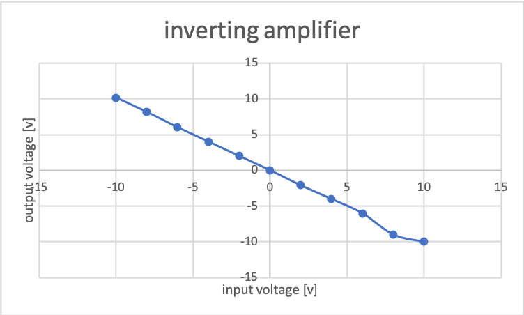
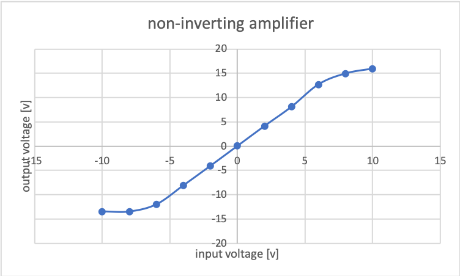

# 2018/12/17 演算増幅器とアクティブフィルタ

## issue
* [x] 図1グラフ横軸直す
* [x] 図2グラフ横軸直す
* [x] 図1が2つある
* [x] 反転増幅回路の値が違う
* [x] 片対数グラフを貼る
* [x] 考察5を直す

### 1/21追加
* [x] 反転増幅回路の回路図を書く
* [x] 非反転増幅回路の回路図を書く
* [x] 積分器の回路図を書く
* [x] ローパスフィルタの回路図を書く
* [x] 考察5を直す
## 目的
演算増幅器(Operational Amplifier, 以下オペアンプという)の動作原理を、基本回路の特性を測定することで理解するとともに、アクティブフィルタへの応用例を学ぶ。

## 実験
* オペアンプの基本回路(反転増幅回路,非反転増幅回路,積分回路)
* アクティブフィルタ

### 使用機器/準備するもの
* オペアンプ実験装置
* 2現象オシロスコープ
* ディジタル電圧計
* 直流電源装置
* アクティブフィルタ学習装置
* 2チャンネルエレクトリック電圧計
* 発振器(ファンクションジェネレーター)
* 片対数グラフ用紙

## 実験方法
### オペアンプの基本回路
#### 反転増幅回路
1. 実験書の図3の反転増幅回路を、$R_S=R_F=10k\Omega$(抵抗の値は4桁程度に詳しく測定し、報告書にて報告すること。以下同じ)として構成せよ。
2. $V_1$を$-10V~+10V$(電源電圧の範囲内)で$2V$毎に変化させ、$V_2$と$v_S$を測定せよ。
3. 次に、$R_F$を変化させて、$V_2$の変化を測定せよ。ただし、$V_1$は$1V$一定にする。

抵抗は$9.88k\Omega$と$9.86k\Omega$であった。
測定回路を図1に示す。

図1 反転増幅回路の測定回路

反転増幅回路の入出力結果を表1に整理し、示す。

表1 反転増幅器の入出力測定結果

| 入力電圧$V_1$[V] | 出力電圧$V_2$[V] | $v_s$[mV] | 倍率$\frac{V_2}{V_1} | 
|--------------|--------------|-----------|--------------------| 
| -10          | 10.16        | 2.1       | -1.016             | 
| -8           | 8.15         | 2         | -1.019             | 
| -6           | 6.01         | 2         | -1.00167           | 
| -4           | 4.01        | 2.1       | 1.025              | 
| -2           | 2           | 2.1       | 1                  | 
| 0            | -1.1(mV)         | 2         | 0                  | 
| 2            | -2.1         | 2.1       | -1.05              | 
| 4            | -4.02        | 2.1       | -1.005             | 
| 6            | -6.02        | 2.2       | -1.003333          | 
| 8            | -8.98        | 2.2       | -1.1225            | 
| 10           | -10          | 2.2       | -1                 | 

グラフを図2に示す。

図2 反転増幅器の入出力特性

また、(3)の結果を表2に示す。

表2 (3)の結果

| 抵抗$R_F$[Ω] | 出力電圧[V] | 倍率$\frac{V_2}{V_1} | 
|------------|---------|--------------------| 
| 5k         | -0.503  | -0.503             | 
| 10k        | -1.018  | -1.018             | 
| 30k        | -3.06   | -3.06              | 

#### 非反転増幅器
1. 実験書の図4の非反転増幅器を、$R_S=R_F=10k\Omega$として構成せよ。
2. $V_1$を$-10V~+10V$(電源電圧の範囲内)で$2V$毎に変化させ、$V_2$と$v_S$を測定せよ。
3. 次に、$R_F$を変化させて、$V_2$の変化を測定せよ。ただし、$V_1$は$1V$一定にする。

測定回路を図3に示す。

図3 非反転増幅回路

非反転増幅回路の入出力結果を表3に整理し示す。

表3 非反転増幅器の入出力測定結果

| 入力電圧$V_1$[V] | 出力電圧$V_2$[V] | $v_s$[mV] | 倍率$\frac{V_2}{V_1} | 
|--------------|--------------|-----------|--------------------| 
| -10          | -13.48       | -3500     | 1.348              | 
| -8           | -13.49       | -1355     | 1.69               | 
| -6           | -12.01       | 0.13      | 2.001              | 
| -4           | -8.1         | 1.2       | 2                  | 
| -2           | -4.07        | 1.1       | 2.035              | 
| 0            | 0.029        | 1.1       | 0                  | 
| 2            | 4.13         | 1         | 2.065              | 
| 4            | 8.11         | 1.8       | 2.0275             | 
| 6            | 12.72        | 1.5       | 2.12               | 
| 8            | 14.96        | 65.5      | 1.87               | 
| 10           | 15.95        | 2206      | 1.595              | 

グラフを図4に示す。

図4 非反転増幅回路の入出力特性

(3)の結果を表4に示す。

表4 (3)の結果

| 抵抗$R_F$[Ω] | 出力電圧[V] | 倍率$\frac{V_2}{V_1}$ | 
|------------|---------|--------------------| 
| 5k         | 1.583   | 1.583              | 
| 10k        | 2.128   | 2.128              | 
| 30k        | 4.23    | 4.23               | 

#### 積分器
1. 実験書の図6の積分器を構成する。

使用する値は$R_S=10k\Omega$,$C_F=0.022\mu F$である。
テスターで測ると、$R_S=9.86k\Omega$,$C_F=21.7\mu F$であった。

測定回路を図5に示す。

図5 積分器の測定回路

オシロスコープのグラフを図6に示す。

図6 オシロスコープのグラフ

### アクティブフィルタ
1. 実験書図8のローパスフィルタを次の値で構成せよ。抵抗値、容量値はテスターで実際に測定し、報告書にて報告すること。
> $C_1=1000pF,R_1=16k\Omega$

今回使用したコンデンサは$1560pF$、抵抗器は$15.70k\Omega$であった。
増幅率は
$$
G_V=20\log\frac{出力電圧}{入力電圧}
$$
で求める。

測定回路を図7に示す。

図7 ローパスフィルタの測定回路

増幅率測定結果を表4に示す。

表4 増幅率測定結果

| 入力周波数Hz  | 入力電圧mv | 出力電圧mv | 増幅率dB     | 
|----------|--------|--------|-----------| 
| 100Hz    | 1000mV | 1000mV | 0dB       | 
| 500Hz    | 1000mV | 1000mV | 0dB       | 
| 700Hz    | 1000mV | 1000mV | 0dB       | 
| 1000Hz   | 1000mV | 1000mV | 0dB       | 
| 2000Hz   | 1000mV | 980mV  | -0.1755dB | 
| 3000Hz   | 1000mV | 955mV  | -0.3993dB | 
| 4000Hz   | 1000mV | 920mV  | -0.7242dB | 
| 5000Hz   | 1000mV | 880mV  | -1.1103dB | 
| 6000Hz   | 1000mV | 840mV  | -1.5144dB | 
| 7000Hz   | 1000mV | 800mV  | -1.9382dB | 
| 8000Hz   | 1000mV | 758mV  | -2,4066dB | 
| 9000Hz   | 1000mV | 718mV  | -2.878dB  | 
| 10000Hz  | 1000mV | 680mV  | -3.350dB  | 
| 14000Hz  | 1000mV | 558mV  | -5.0673dB | 
| 18000Hz  | 1000mV | 461mV  | -6.726dB  | 
| 20000Hz  | 1000mV | 428mV  | -7.372dB  | 
| 40000Hz  | 1000mV | 235mV  | -12.58dB  | 
| 50000Hz  | 1000mV | 190mV  | -14.42dB  | 
| 100000Hz | 1000mV | 105mV  | -19.57dB  | 

グラフを図8に示す。

図7 アクティブフィルタの測定結果 ローパスフィルタのグラフに関しては最後にグラフ用紙を添付する

## 考察
### 考察1
反転増幅回路における入力$V_1$と出力$V_2$の関係式は、次のように表される。
$$
V_2=-\frac{R_f}{R_s}V_1
$$
この式を導出せよ。

オペアンプの入力インピーダンスが高いので電流が流れないと考えると$R_S$に流れる電流と$R_F$に流れる電流が等しいと考えることができる。
$R_S$に流れる電流はオイラーの公式より$\frac{V_1}{R_S}$で表される。
$R_F$に流れる電流はオイラーの公式より$\frac{V_2}{R_F}$で表される。
$\therefore$ $\frac{V_1}{R_s}=\frac{V_2}{R_F}$となる。
$V_2$について解くと、$V_2=-\frac{R_f}{R_s}V_1$となる。

### 考察2
非反転増幅器における入力$V_1$と出力$V_2$の関係式は、次のように表される。
$$
V_2=\left\{
    1+\frac{R_f}{R_s}
\right\}V_1
$$
この式を導出せよ。

オペアンプの入力インピーダンスが大きいため電流は流れないと考える。
すると$R_S$に流れる電流と$R_f$に流れる電流が等しいと考えられる。
キルヒホッフの法則より$V_1=0-R_S\times I$、$V_2=V_1-R_f\times I$と表される。
$\therefore$ $V_2=\left\{1+\frac{R_f}{R_s}\right\}V_1$となる。[^1]
[^1]:参考：https://algorithm.joho.info/denki-denshi/operational-not-inverting-amplifier-circuit/

### 考察3
積分器における入力$V_1$と出力$V_2$の関係式を$C_F$,$R_S$,$\omega$を使って示せ。
また実験4.1.2の結果より積分器の積分計算について原理上の計算値と測定値を比較せよ。

オペアンプの入力インピーダンスが高いので電流が流れないと考える。
すると$R_S$に流れる電流と$C_F$に流れる電流が等しいと考えられる。
$R_S$に流れる電流はオイラーの公式より$\frac{V_1}{R_S}$と表される。
$C_F$に流れる電流は$\frac{1}{\omega C_F}$で表される。
$\therefore$ $\frac{V_1}{R_S}=\frac{1}{\omega C_F}$となる。これを$V_1$について解くと$V_1=\frac{R_S}{\omega C_F}$となる。

### 考察4
実験4.2のローパスフィルタにおいて、「カットオフ周波数」、「阻止域」、「通過域」の意味を調べ説明せよ。

#### カットオフ周波数
カットオフ周波数とは、フィルタ回路における通過域と阻止域の境目の周波数のこと。[^2]
[^2]: 参考：https://synapse.kyoto/glossary/glossary.php?word=カットオフ周波数

#### 阻止域
フィルタ回路における通過させない帯域のこと。無限大の衰退(通過率0%)の帯域のこと。[^3]

### 通過域
フィルタ回路における通過させる帯域のこと。衰退0(通過率100%)の帯域のこと。[^3]
[^3]:参考：http://bricolage.tuzikaze.com/doc/filter/filter_euc/filter_euc.html

### 考察5
実験4.2のローパスフィルタにおいて、増幅率が3dB低下する周波数(カットオフ周波数)と、阻止域に入ったときの傾きを[dB/oct]単位で求めよ。
ここでoctは周波数が2倍になる点を意味し、カットオフ周波数から周波数が2倍に変化した場合の増幅率の変化量を求めればいい。

グラフ用紙より3dBのとき周波数は9.4kHzであった。
倍の周波数18.8kHzのとき、6.8dBだった。$\therefore$6.8[dB/oct]

### 考察6
実験4.2のローパスフィルタにおいてカットオフ周波数の計算値と上記(5)で求めた測定値と比較せよ。

カットオフ周波数$f_c$は以下の式で求めれられる。[^4]
[^4]:参考：https://synapse.kyoto/glossary/glossary.php?word=カットオフ周波数

$f_c=\frac{1}{2\pi CR}$
$\therefore$ $f_c=\frac{1}{2\times\pi 1000 \times 10^{-12}\times 16 \times 10^3}=9947.18$[Hz]

### 考察7
今回の実験から自分が理解できたことを報告せよ

オペアンプの入力インピーダンスが高いので電流が流れ込まないという考え方を知った。そしてその理由としてイマジナリーショートという現象があることを理解した。[^1]

またフィルタ回路に関してはDJをしている関係で以前から親しみがあった。[^5]今回の実験でしくみを実験を通して見ることができたので今後のパフォーマンスに活かしたいと思うが、具体的な方法はまだ思いつけていないので今後の課題としたい。
[^5]:DJをする際のエフェクターの一つにハイパスフィルタとローパスフィルタがある。それぞれ音にフィルタをかけ、変化を与えることができ違和感のないmixを助けてくれる。

## 参考
