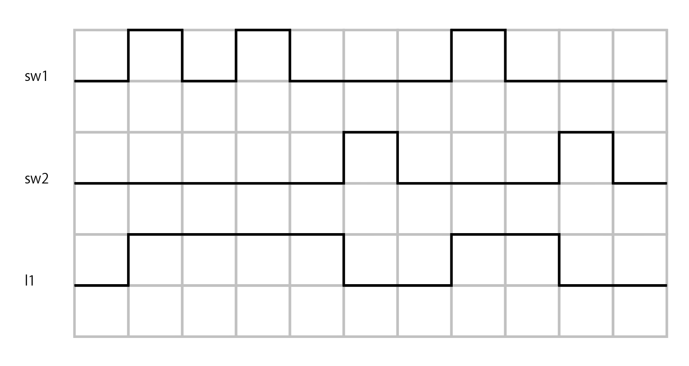
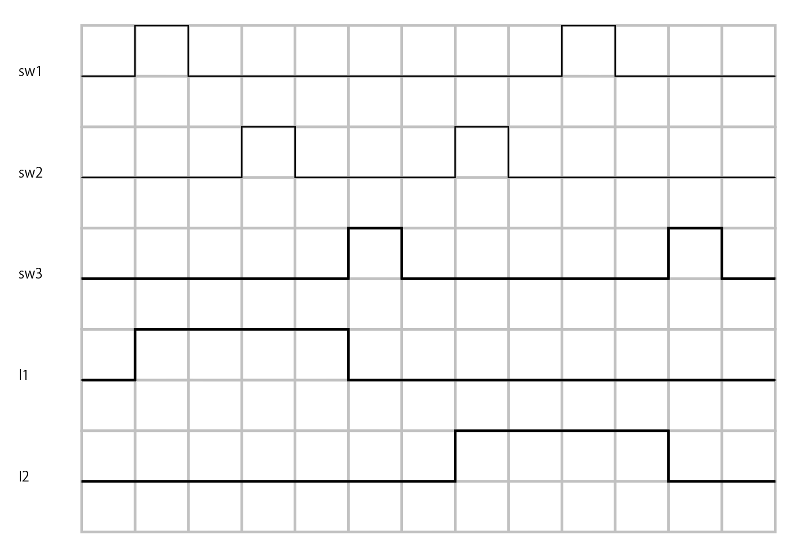

# 順序回路1

## 目的
論理ゲートを組み合わせた順序回路の制作を通して、順序回路の動作原理について理解する。

## 実験
* 論理回路トレーナーを使用して順序回路の制作と動作確認を行う。

### 使用器具
* 論理回路トレーナー
* ACアダプター
* 論理IC
* ジャンパー線

## 実験
### 実験1
自己保持回路の観察
* 自己保持回路は1ビットの情報を記憶する回路である。
* 順序回路では、回路の動作が複雑になり真理値表だけでは動作を表すことができない。そこでタイムチャートを用いる。
* 自己保持回路を作り、タイムチャートの通り操作して値が保持されることを確認せよ。

回路を図1に示す。

図1 自己保持回路

値が保持されていることを確認できた。
タイムチャートをタイムチャート1に示す。

タイムチャート1

### 実験2
* 図2の自己保持回路は出力の値を保持する機能とリセットする機能がある。
* この回路を作り、タイムチャートのようにsw1とsw2を操作してl1の変化を確認せよ。
* l1の出力を含めたタイムチャートを作成し、報告せよ。

回路を図2に示す。

図2 リセット付き自己保持回路

タイムチャートをタイムチャート2に示す。

タイムチャート2

### 実験3
インターロック回路
* 図3に示す回路は2系統の自己保持回路の間に優先度の区別を設けたものである。
* 図3のインターロック回路を作り、動作を確認せよ。入力の値の切替にはデータスイッチをｓ異様し、出力の値の変化は発光ダイオードを使用して確認する。
* タイムチャート3のように入力sw1とsw2の値を変化させ、出力l1とl2の値の変化を確認せよ。

回路を図3に示す。

図3 インターロック回路

タイムチャートをタイムチャート3に示す。

### 実験4
並列優先回路
* 図4に示す並列優先回路を作り、動作を確認せよ。

回路を図4に示す。

図4 並列優先回路

タイムチャートをタイムチャート4に示す。

### 実験5
新入力優先回路
* 図5に示す回路を作り、動作を確認せよ。

回路を図5に示す。

図5 新入力優先回路

タイムチャートをタイムチャート5に示す。

タイムチャート5

### 実験6
直列優先回路
* 図6に示す直列優先回路を作り、動作を確認せよ。

回路を図6に示す。

図6 直列優先回路

タイムチャートをタイムチャート6に示す。

タイムチャート6

### 実験7
早押しクイズの回路
* 3人の回答者が使用する早押しクイズの回路を作成せよ。
* 入力はsw1,sw2,sw3,sw4の4つでsw4がリセットである。
* 出力はl1,l2,l3でそれぞれsw1,sw2,sw3の出力に対応している

回路を図7に示す。

図7 早押しクイズの回路

タイムチャートをタイムチャート7に示す。

タイムチャート7

## 考察
### 考察1
リセット付き自己保持回路を図8のように変更するとRSフリップフロップ回路の動作となる。
入力と出力の関係をしらべ、入出力表を完成させよ。

図8 RSフリップフロップ回路

入出力表を表1に示す。

表1 RSフリップフロップ回路

| R | S | Q | Qバー | 状態     | 
|---|---|---|-----|--------| 
| 0 | 0 | 0 | 0   | 状態を保持  | 
| 0 | 1 | 1 | 0   | セット状態  | 
| 1 | 0 | 0 | 1   | リセット状態 | 
| 1 | 1 | 1 | 1   | 禁止     | 

### 考察2
RSフリップフロップ回路ではS=1,R-1は禁止となっている。
1,1が入力されると状態は0,0となるが、その後同時に0,0に変化すると出力がメタステーブル状態になり、一定時間その状態が続く。そのためq,qバーの状態が定まらなくなり論理回路の誤作動の原因となる。
このメタステーブル状態とは具体的にどのような現象なのか。

メタステーブルとは一時的に1と0のだいたい中間の電圧を示すような状態を示す。[^1]
[^1]:参考：https://www.weblio.jp/content/メタステーブル

## 参考
