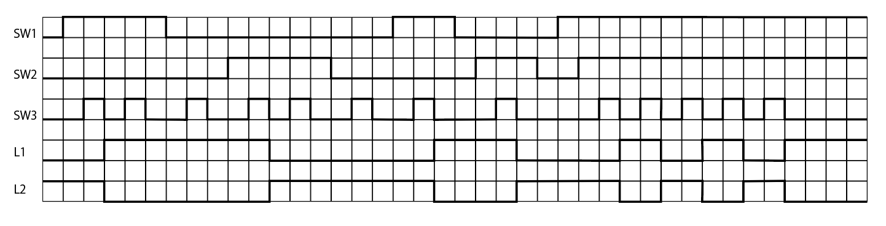
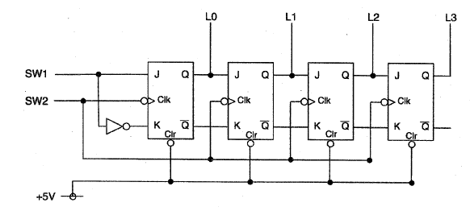
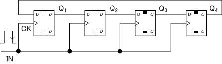

# 順序回路2

## 目的
代表的な順序回路であるフリップフロップの動作原理について理解を深めるとともに、これを組み合わせたカウンタ回路やシフトレジスタについて学習する。

## 実験内容
論理回路トレーナーを使用してフリップフロップ、カウンタ回路、シフトレジスタの制作と動作確認を行う。

### 使用器具
* 論理回路トレーナー
* ACアダプター
* 論理IC
* ジャンパー線

## 実験
### 実験1
Dフリップフロップの作成
1. 論理回路トレーナーとジャンパー線を使用して図1に示すDフリップフロップ回路を作成せよ。
2. タイムチャート1に示すようにSW1とSW2を操作して、L1とL2の変化を記入してDフリップフロップのタイムチャートを完成させて報告せよ。

図1 Dフリップフロップ回路

タイムチャート1

### 実験2
JKフリップフロップの動作
1. 論理回路トレーナーとジャンパー線を使用して、図2に示すJKフリップフロップ回路を作成せよ。
2. タイムチャート2に示すようにSW1とSW2とSW3を操作してL1とL2の変化を記入し、JKフリップフロップのタイムチャートを完成させて報告せよ。

図2 JKフリップフロップ回路

タイムチャート2

### 実験3
2ビット2進カウンタの作成
1. 論理回路トレーナーとジャンパー線を使用して、図3に示すカウンタ回路を作成せよ。
2. タイムチャート3に示すようにSW1とSW2を操作してL0とL1の変化を記入しタイムチャートを完成させて報告せよ。

図3 2ビット2進カウンタ回路

タイムチャート3

### 実験4
4ビット2新カウンタの作成
1. 論理回路トレーナーとジャンパー線を使用して、図4に示すカウンタ回路を作成せよ。
2. タイムチャート4に示すようにSW1とSW2を操作して、L0とL1とL2の変化を記入し、タイムチャートを完成させて報告せよ。

図4 4ビット2進カウンタ回路

タイムチャート4

### 実験5
7セグメントLEDによる16新数表示
図5に示す7セグLEDにさきほどの端子を接続すると16進数でカウンタの値が表示された。

図5 7セグLED

### 実験6
4ビットシフトレジスタの作成
1. 論理回路トレーナーとジャンパー線を使用して、図6に示す4ビットシフトレジスタを作成せよ
2. タイムチャート5に示すSW1とSW2、SW3を操作してL0とL1、L2、L3の変化を記入しタイムチャートを完成させて報告せよ。

図6 4ビットシフトレジスタ回路

タイムチャート5

## 考察
### 1
JKフリップフロップをAND、OR、NOTで構成する場合の回路例を調べ、報告せよ。

ANDとNOTを組み合わせたNANDを用いたJKフリップフロップ回路を図7に報告する。

図7 NANDを用いたJKフリップフロップ回路

### 2
JKフリップフロップのタイムチャートよりSW3がONになるときのSW1(J)とSW2(K)の入力とL1(Q)の出力の関係を表1に示す。[^1]
[^1]:参考：https://ja.wikipedia.org/wiki/フリップフロップ

表1 JKフリップフロップの入出力

| J | K | Q            | Qの動作 | 
|---|---|--------------|------| 
| 0 | 0 | Q            | 待機   | 
| 0 | 1 | 0            | 0    | 
| 1 | 0 | 1            | 1    | 
| 1 | 1 | $\overline{Q}$ | Qの反転 | 

### 3
シフトレジスタを使用した応用例としてリングカウンタがある。
どのような回路かを調べその特徴を報告せよ。

回路を図8に示す。[^2]

図8 リングカウンタ回路

[^2]:参考：http://akademeia.info/index.php?%A5%EA%A5%F3%A5%B0%A5%AB%A5%A6%A5%F3%A5%BF

特徴としては、シフトレジスタでは最終段までいくとLEDが全て消灯するが、リングカウンタでは最終段に到達すると1段目にもどってえきて循環する。
